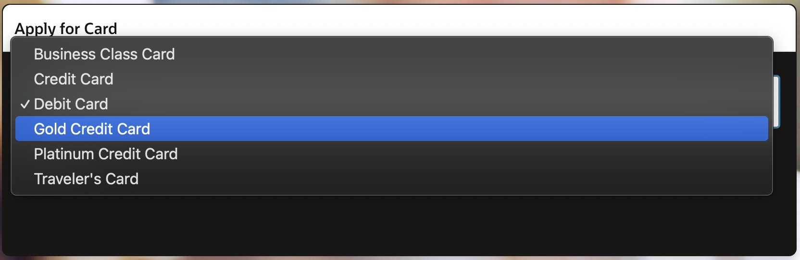
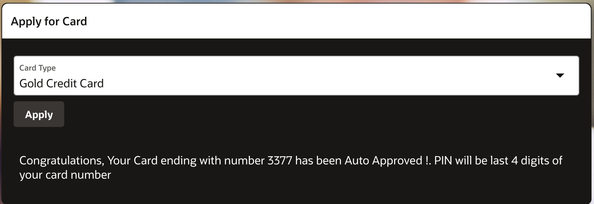

# Credit Card Applications: Applying for a New Credit Card

## About this workshop

Welcome to this workshop on premium bank account and card application! In this session, we'll explore the process of creating a seamless user experience for applying for premium bank accounts and associated card options. You'll learn how to design user interfaces for account applications, retrieve eligible card options, and apply for credit or debit cards.

Estimated Time: 30 minutes

---

### Objectives

TBD

---

### Prerequisites

* Lab related to Opening Bank Account should be completed.
* A user with access to provision & manage core OCI services  
* Having completed common labs

---
 
## Task 1: Premium Account Application

1. Develop a user interface to apply for a premium bank account.
  
      

## Task 2: Eligible Card Options
 
1.  Retrieve and display the list of eligible card options for the premium account holder.
 
      

## Task 2: Card Application
 
1.  Create a process for applying for a credit or debit card, allowing users to select their preferred card option.
 
      
 
## Acknowledgements

* **Author** - Madhusudhan Rao B M, Principal Product Manager, Oracle Database
* **Last Updated By/Date** - April 17th, 2025

## Learn more
 
* [Oracle Digital Assistant Skills](https://docs.oracle.com/en/cloud/paas/digital-assistant/use-chatbot/create-configure-and-version-skills1.html)
