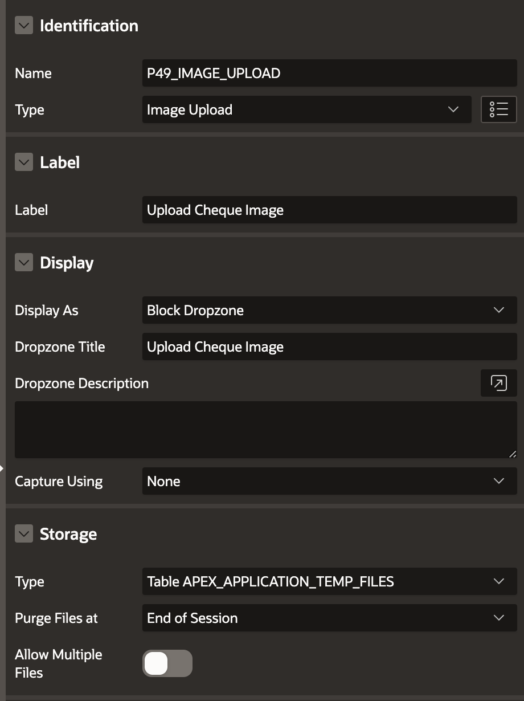
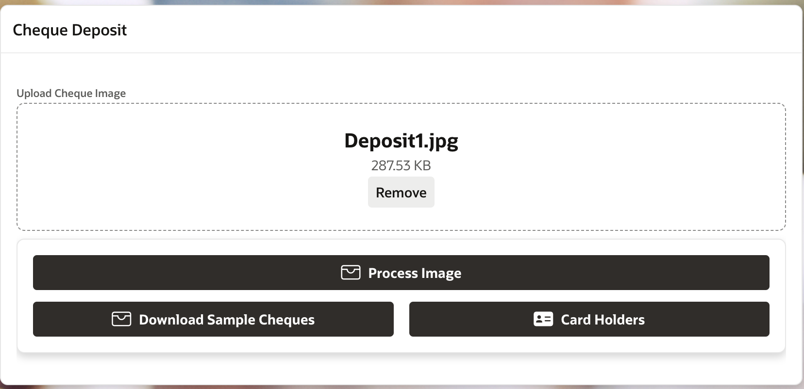

# Cheque Deposit: Depositing Cheques at an ATM

## About this workshop

This workflow involves uploading cheque image files to an Oracle APEX application, processing the images to extract relevant cheque information, and verifying the accuracy of the extracted data with the user. By automating these steps, the process aims to streamline cheque processing, reduce manual errors, and improve overall efficiency

Estimated Time: 60 minutes

---

### Objectives

Cheque Processing Workflow

- Image File Upload: Upload cheque image files to Oracle APEX application.
- Image Processing: Extract cheque information from uploaded images.
- User Verification: Confirm extracted information with the user.

---

### Prerequisites

* A user with access to provision & manage core OCI services  
* Having completed common labs

--- 
 
### Introduction to this Lab

[Demo video on AI for Financial Services](youtube:kx5syoF3aVk:large) 

---
 
## Task 1: Cheque Image Upload

1. Upload a cheque image file to the Oracle APEX application's temporary file storage.
  
     

2. Front end user interface will have upload page item along with a submit button 
    
      
    
## Task 2: Cheque Information Extraction
 
1.  Process the uploaded image file to extract relevant cheque information.
   
     

2. PL/SQL FUNCTION to generate audio from text, that is Text to Speech AI to generate .mp3 audio file and save it in OCI Object storage bucket

    ```sql 
        <copy>
        create or replace FUNCTION text2speech (text_input IN VARCHAR2 )  RETURN VARCHAR2  
        AS  
            speech_endpoint  varchar2(500) := 'https://speech.aiservice.us-phoenix-1.oci.oraclecloud.com/20220101/actions/synthesizeSpeech'; 
            resp dbms_cloud_types.RESP; 
            request_json CLOB; 
            request_body BLOB;       
            p_file_blob    BLOB; 
            x_object_store_url  MACHINE_LEARNING_CONFIGS.GC_OCI_OBJ_STORE_BASE_URL%TYPE; 
            l_response            CLOB;  
            v_rand_no number; 
            v_filename varchar2(100); 
            v_compartment_id varchar2(1000) := 'ocid1.compartment.oc1..your-compartment-ocid';   
            l_web_cred        CONSTANT VARCHAR2(50)   := 'replace-this';     
            l_response_json CLOB; 
            l_text varchar2(4000); 
            l_prompt varchar2(1000);   
            v_planetext varchar2(32000); 
            l_ocigabody varchar2(32000);  
            v_voice varchar2(20) := 'Cindy'; 
            v_custname varchar2(50);
            v_amount number;
        
            CURSOR C1  IS  
                    SELECT jt.*  
                    FROM   JSON_TABLE(l_response_json, '$'  COLUMNS (text VARCHAR2(32000)  PATH '$.chatResponse[0].text' )) jt;  
          
        BEGIN 
        
            v_rand_no := round(DBMS_Random.Value(1,10000),0);  
            v_filename := 'Audio'||v_rand_no||'.mp3';  
            -- Replace Object storage url as per your tenancy and storage bucket created
            x_object_store_url := 
            'https://objectstorage.us-phoenix-1.oraclecloud.com/n/your-tenancy/b/your-bucket/o/Speech/'||v_filename;   
            
            request_json := to_clob( 
                '{ 
                  "audioConfig": { 
                    "configType": "BASE_AUDIO_CONFIG" 
                  }, 
                  "compartmentId": "'||v_compartment_id||'", 
                  "configuration": { 
                    "modelDetails": { 
                      "modelName": "TTS_2_NATURAL", 
                      "voiceId": "'||v_voice||'" 
                    }, 
                    "modelFamily": "ORACLE", 
                    "speechSettings": { 
                      "outputFormat": "MP3", 
                      "sampleRateInHz": 23600, 
                      "speechMarkTypes": ["WORD"], 
                      "textType": "TEXT" 
                    } 
                  }, 
                  "isStreamEnabled": true, 
                  "text": "'||text_input||'"            
                }' 
            ); 
            
            -- where GENAI_CRED is OCI cloud credentials generated
            request_body := apex_util.clob_to_blob(p_clob => request_json,p_charset => 'AL32UTF8');  
            resp := dbms_cloud.send_request( 
                credential_name => 'GENAI_CRED', 
                uri => speech_endpoint, 
                method => dbms_cloud.METHOD_POST, 
                body => request_body 
            );    
            p_file_blob := dbms_cloud.get_response_raw(resp);   
            
            apex_web_service.g_request_headers.DELETE;  
            apex_web_service.g_request_headers(1).name  := 'Content-Type';  
            apex_web_service.g_request_headers(1).value := 'audio/mpeg';   
            -- Call Web Service to PUT file in OCI.  
            l_response := apex_web_service.make_rest_request  
            (p_url                  => UTL_URL.ESCAPE(x_object_store_url),  
            p_http_method          => 'PUT',  
            p_body_blob            => p_file_blob,   
            p_credential_static_id => l_web_cred);  
        
            IF apex_web_service.g_status_code != 200 then  
            raise_application_error(-20111,'Unable to Upload File to OCI.');  
            END IF;  
        
            RETURN v_filename;  
        END text2speech;
        /
        </copy>
    ```

3. We can extract the cheque information with the following PL/SQL

    ```sql 
        <copy>
        DECLARE
          l_blob_content blob;
          l_mime_type varchar2(200);
          l_file_name varchar2(200);
          l_base64_content clob;
          l_response_text clob;
          l_request_body clob; 
          l_text varchar2(32000); 
          l_api_url varchar2(2000) := 
          'https://inference.generativeai.us-chicago-1.oci.oraclecloud.com/20231130/actions/chat';
          l_compartment_id varchar2(1000) := 'ocid1.compartment.oc1..your-compartment-ocid';
          l_model_id varchar2(100) := 'meta.llama-3.2-90b-vision-instruct';
          l_id number;
          l_cardno number;
          l_first_name varchar2(50);
          l_status varchar2(20);
          l_input_text varchar2(100) := 'What is the Date, Payee and Amount on this Cheque';
          l_audio_content varchar2(1000);
          l_filename varchar2(100) := 'NOFILE';
          
        BEGIN
          -- page numbers and page item names may vary in your setup
          select blob_content, mime_type, filename, id
          into l_blob_content,l_mime_type, l_file_name, l_id
          from apex_application_temp_files
          where name = :P49_IMAGE_UPLOAD;
        
          dbms_lob.createtemporary(l_base64_content, true); 
        
          SELECT
              REPLACE(REPLACE(APEX_WEB_SERVICE.BLOB2CLOBBASE64(l_blob_content), CHR(10), ''), CHR(13), '')
              into l_base64_content
              from dual;

          -- Build JSON request body
          l_request_body := ' 
          {
              "compartmentId": "'||l_compartment_id||'",
              "servingMode": {
                  "servingType": "ON_DEMAND",
                  "modelId": "meta.llama-3.2-90b-vision-instruct"
              },
              "chatRequest": {
                "messages": [
                  {
                      "role": "USER",
                        "content": [
                          {
                              "type": "TEXT",
                              "text": "'||l_input_text||'"
                          },
                          {
                              "type": "IMAGE",
                              "imageUrl": {
                                  "url": "data:image/png;base64,'||l_base64_content||'"
                              }
                          }   
                      ] 
                  }
              ],
                  "maxTokens": 2500,
                  "isStream": false,
                  "apiFormat": "GENERIC",
                  "temperature": 0.75,
                  "frequencyPenalty": 1,
                  "presencePenalty": 0,
                  "topP": 0.7,
                  "topK": 1
              }
          }';
      
          apex_web_service.g_request_headers(1).name := 'Content-Type';
          apex_web_service.g_request_headers(1).value := 'application/json';

          -- Make the API call
          l_response_text := apex_web_service.make_rest_request(
              p_url => 'https://inference.generativeai.us-chicago-1.oci.oraclecloud.com/20231130/actions/chat',
              p_http_method => 'POST',
              p_body => l_request_body,
              p_credential_static_id => 'replace-this'--'OCI web credentials'
          );
      

          SELECT jt.text INTO l_text
          FROM dual,
              JSON_TABLE(
                  l_response_text,
                  '$.chatResponse.choices[*].message.content[*]'
                  COLUMNS (
                      text CLOB PATH '$.text'
                  )
              ) jt;
        
          l_audio_content := l_text||' Please confirm to Deposit or Sign out to Cancel';
          -- Generate Audio 
          l_filename := text2speech (l_audio_content );

          -- Get cheque details into front end ATM page. 
          :P49_ID := l_id;
          :P49_DETAILS := l_text;
          :P49_INFO := 'Cheque Deposited';
          :P49_FILENAME := l_filename;
        
          -- Add success message
          apex_application.g_notification := 'API called successfully!';
      
        END; 
        </copy>
    ```
 
## Task 3: User Confirmation
 
1.  Display the extracted cheque information on-screen for user review and confirmation.
    
    > **Congratulations**, you have completed **Cheque Deposit: Depositing Cheques at an ATM** Lab. The subsequent labs are optional, however, please proceed to the next lab to learn more about **Cash Withdrawal: Withdrawing Cash from an ATM**. 
  
## Acknowledgements

* **Author** - Madhusudhan Rao B M, Principal Product Manager, Oracle Database
* **Last Updated By/Date** - April 17th, 2025

## Learn more
 
* [Unlocking the Power of Generative AI Meta Llama Instruct and Vision Models with Oracle Database 23ai](https://www.linkedin.com/pulse/unlocking-power-generative-ai-meta-llama-instruct-vision-rao-q0myf)
