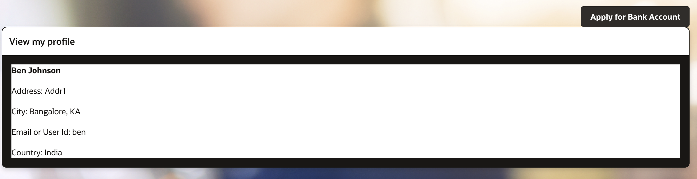
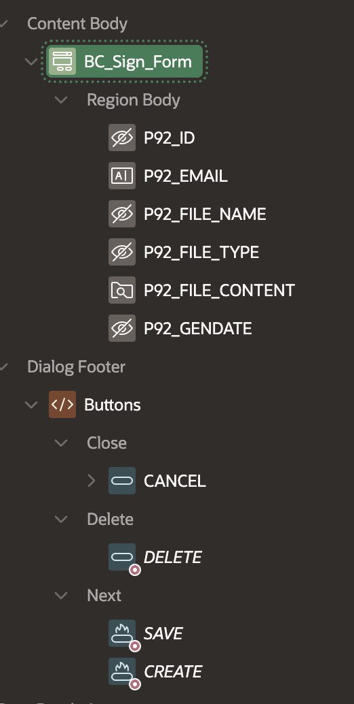
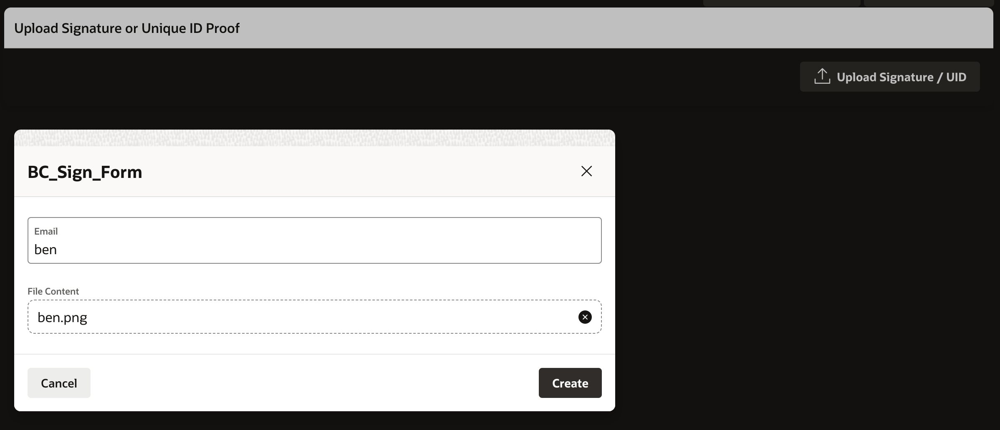
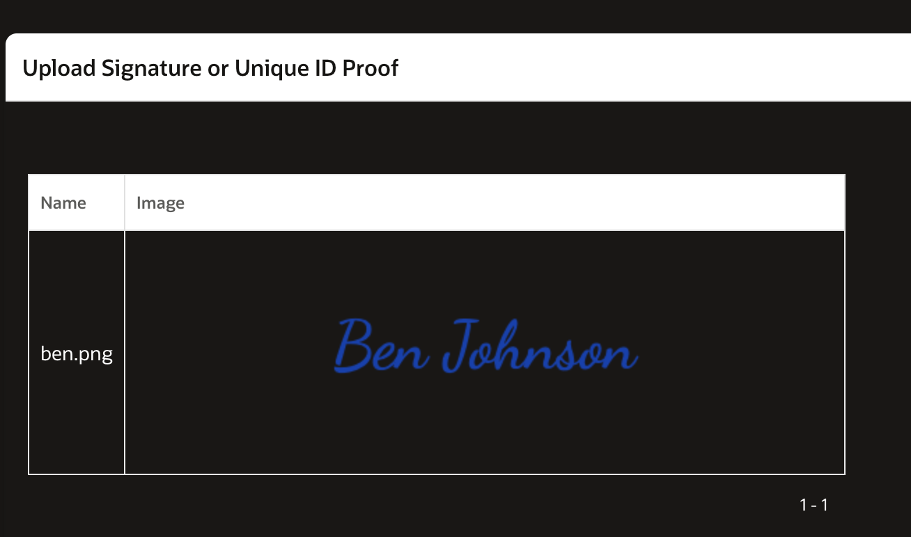
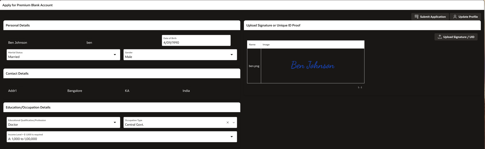
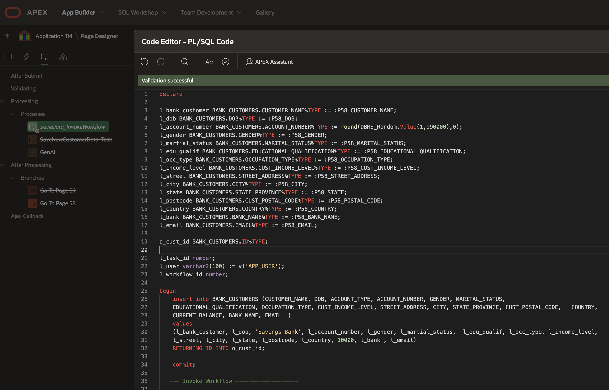

# Account Creation: Establishing a New Bank Account

## About this workshop

TBD

Estimated Time: 30 minutes

---

### Objectives

TBD

---

### Prerequisites

* A user with access to provision & manage core OCI services  
* Having completed common labs

--- 
 
### Introduction to this Lab

<!-- [Demo video on AI for Financial Services](youtube:E17kftPQ7Gg:large)   -->

---
 
## Task 1: Update and complete profile

1. Login into **AI for Financial Services** web page
  
      

## Task 2: View profile information and Apply for Bank Account
 
1.  Update profile information, earlier in previous lab we had just registered, here since we want to open a bank account, few additional details are required.

     

2. Dynamic PL/SQL region to get profile information from **COMMON\_USERS** table

    ```sql 
        <copy>
        declare
        l_user_id number;
        l_fullname varchar2(255);
        l_address1 varchar2(255);
        l_address2 varchar2(255);
        l_city_statezip varchar2(255);
        l_email varchar2(128);
        l_country varchar2(128);

        begin
            select user_id,
                first_name||' '|| last_name, 
                address1, 
                address2, email,
                city||', '|| statezip,
                country
            into l_user_id,l_fullname,l_address1,l_address2,l_email, l_city_statezip, l_country
                from common_users where   upper(email) = upper(v('APP_USER')) ;

            Htp.p('<div style="color:#191715; background-color:white">');
                if l_fullname!=',' then
                htp.p('<p><b>  '||l_fullname||'</b></p>');
                end if;
                htp.p('<p>Address: '||l_address1||'</p>');
                htp.p('<p> '||l_address2||'</p>'); 
                if l_city_statezip!=',' then
                htp.p('<p>City: '||l_city_statezip||' </b></p>');
                end if;
                htp.p('<p>Email or User Id: '||l_email||'</p>');
                htp.p('<p>Country: '||l_country||'</p>');
            Htp.p('</div>');
        end;
        </copy>
    ```

3. Click on **Apply for Bank Account** button

## Task 3: Create Signature
 
1.  Generate and Upload Signature in png format, this will be stored in blockchain table

     

## Task 4: Create Blockchain Table and Oracle APEX form to upload the signature
 
1.  Blockchain table create statement
2.  Create table statement
    
    ```sql 
        <copy>
        CREATE BLOCKCHAIN TABLE "USER_PROFILE_BC" 
        (	
            "ID" NUMBER GENERATED BY DEFAULT ON NULL AS IDENTITY MINVALUE 1 MAXVALUE 9999999999999
            999999999999999 INCREMENT BY 1 START WITH 1 CACHE 20 NOORDER  NOCYCLE  NOKEEP  NOSCALE  NOT NULL ENABLE, 
            "EMAIL" VARCHAR2(128), 
            "FILE_NAME" VARCHAR2(900), 
            "FILE_TYPE" VARCHAR2(900), 
            "FILE_CONTENT" BLOB, 
            "GENDATE" DATE DEFAULT sysdate, 
            PRIMARY KEY ("ID")
            USING INDEX  ENABLE
        ) ;
        </copy>
    ```
3. Create an Oracle APEX form to upload **USER\_PROFILE\_BC** table

     

## Task 5: Upload Signature to BLOCKCHAIN Table
 
1.  Upload the file using File Upload Page item, this signature will be stored in blockchain table

     

## Task 6: View Signature from the BLOCKCHAIN Table
 
1.  View Signature from the BLOCKCHAIN Table

     

    ```sql 
        <copy>
        select "ID", "EMAIL", "FILE_NAME", "FILE_TYPE", sys.dbms_lob.getlength("FILE_CONTENT") "FILE_CONTENT" ,"GENDATE" from "USER_PROFILE_BC" where upper(email) = upper(v('APP_USER'))
        </copy>
    ```

## Task 7: Create Bank Customers Table
 
1.  Here we are store applications in the bank customers table, you can also create a table with different name such as bank application table or just applications table, it is your choice. please feel free to add or remove columns as per your application needs.  

    ```sql 
        <copy>
          CREATE TABLE "BANK_CUSTOMERS" 
            (	
                "ID" NUMBER GENERATED BY DEFAULT ON NULL AS IDENTITY MINVALUE 1 MAXVALUE 999999999999 
                INCREMENT BY 1 START WITH 1 CACHE 20 NOORDER  NOCYCLE  NOKEEP  NOSCALE  NOT NULL ENABLE, 
                "GENDER" VARCHAR2(1), 
                "CUST_YEAR_OF_BIRTH" NUMBER, 
                "MARITAL_STATUS" VARCHAR2(50), 
                "STREET_ADDRESS" VARCHAR2(255), 
                "CUST_POSTAL_CODE" NUMBER, 
                "CITY" VARCHAR2(50), 
                "STATE_PROVINCE" VARCHAR2(50), 
                "COUNTRY_ID" VARCHAR2(50), 
                "PHONE_NUMBER" VARCHAR2(50), 
                "CUST_INCOME_LEVEL" VARCHAR2(500), 
                "CREDIT_LIMIT" NUMBER, 
                "CUST_VALID" VARCHAR2(1), 
                "CUSTOMER_NAME" VARCHAR2(100), 
                "BUYING" VARCHAR2(50), 
                "PRICE" NUMBER, 
                "DOB" DATE, 
                "CUSTOMER_ID" VARCHAR2(20), 
                "ACCOUNT_NUMBER" NUMBER, 
                "ACCOUNT_TYPE" VARCHAR2(20), 
                "REFERENCE_RELATION" VARCHAR2(10), 
                "REFERENCE_NAME" VARCHAR2(100), 
                "COUNTRY" VARCHAR2(50), 
                "CITIZENSHIP" VARCHAR2(100), 
                "OCCUPATION_TYPE" VARCHAR2(50), 
                "INCOME_SOURCE" VARCHAR2(500), 
                "EDUCATIONAL_QUALIFICATION" VARCHAR2(100), 
                "CURRENT_BALANCE" NUMBER, 
                "ACCOUNT_STATUS" VARCHAR2(100), 
                "BANK_NAME" VARCHAR2(100),  
                "REQUEST_CARD" VARCHAR2(10), 
                "EMAIL" VARCHAR2(128), 
                PRIMARY KEY ("ID")
            USING INDEX  ENABLE
            ) ;
        </copy>
    ```
 
## Task 7: Complete the Application Form
 
1.  Complete the Application Form, Provide information such as Date of Birth, Education, Income etc.. 

     

2. Submit the application, this will insert the record in **BANK\_CUSTOMERS** table, the corresponding PL/SQL process to save record is shown below.

     

    ```sql 
        <copy>
        declare 

        l_bank_customer BANK_CUSTOMERS.CUSTOMER_NAME%TYPE := :P58_CUSTOMER_NAME;
        l_dob BANK_CUSTOMERS.DOB%TYPE := :P58_DOB;
        l_account_number BANK_CUSTOMERS.ACCOUNT_NUMBER%TYPE := round(DBMS_Random.Value(1,990000),0);  
        l_gender BANK_CUSTOMERS.GENDER%TYPE := :P58_GENDER;
        l_martial_status BANK_CUSTOMERS.MARITAL_STATUS%TYPE := :P58_MARITAL_STATUS; 
        l_edu_qualif BANK_CUSTOMERS.EDUCATIONAL_QUALIFICATION%TYPE := :P58_EDUCATIONAL_QUALIFICATION;
        l_occ_type BANK_CUSTOMERS.OCCUPATION_TYPE%TYPE := :P58_OCCUPATION_TYPE;
        l_income_level BANK_CUSTOMERS.CUST_INCOME_LEVEL%TYPE := :P58_CUST_INCOME_LEVEL;
        l_street BANK_CUSTOMERS.STREET_ADDRESS%TYPE := :P58_STREET_ADDRESS;
        l_city BANK_CUSTOMERS.CITY%TYPE := :P58_CITY;
        l_state BANK_CUSTOMERS.STATE_PROVINCE%TYPE := :P58_STATE; 
        l_postcode BANK_CUSTOMERS.CUST_POSTAL_CODE%TYPE := :P58_POSTAL_CODE; 
        l_country BANK_CUSTOMERS.COUNTRY%TYPE := :P58_COUNTRY; 
        l_bank BANK_CUSTOMERS.BANK_NAME%TYPE := :P58_BANK_NAME; 
        l_email BANK_CUSTOMERS.EMAIL%TYPE := :P58_EMAIL; 

        o_cust_id BANK_CUSTOMERS.ID%TYPE;

        l_task_id number;
        l_user varchar2(100) := v('APP_USER');
        l_workflow_id number;

        BEGIN
            insert into BANK_CUSTOMERS (CUSTOMER_NAME, DOB, ACCOUNT_TYPE, ACCOUNT_NUMBER, GENDER, MARITAL_STATUS,  
            EDUCATIONAL_QUALIFICATION, OCCUPATION_TYPE, CUST_INCOME_LEVEL, STREET_ADDRESS, CITY, STATE_PROVINCE, CUST_POSTAL_CODE,   COUNTRY,
            CURRENT_BALANCE, BANK_NAME, EMAIL  ) 
            values 
            (l_bank_customer, l_dob, 'Savings Bank', l_account_number, l_gender, l_martial_status,  l_edu_qualif, l_occ_type, l_income_level,
            l_street, l_city, l_state, l_postcode, l_country, 10000, l_bank , l_email)
            RETURNING ID INTO o_cust_id;  

            commit;
        
        --- Comment Invoke Workflow section till the Workflow is ready -------------------
        --- Invoke Workflow -------------------
            
        l_workflow_id := 
            apex_workflow.start_workflow 
            --- MYBANKWF1 replace this with name of your workflow
            (p_static_id      => 'MYBANKWF1',
            p_detail_pk      => o_cust_id,
            p_initiator      => UPPER(l_user),
            p_parameters     => apex_workflow.t_workflow_parameters
                                    (1 => apex_workflow.t_workflow_parameter(static_id => 'P_ACCOUNT_NUMBER', string_value => l_account_number),
                                    2 => apex_workflow.t_workflow_parameter(static_id => 'P_CUSTOMER_ID', string_value => o_cust_id),
                                    3 => apex_workflow.t_workflow_parameter(static_id => 'P_CUSTOMER_NAME', string_value => l_bank_customer),
                                    4 => apex_workflow.t_workflow_parameter(static_id => 'P_INCOME_LEVEL', string_value => l_income_level)),
            p_debug_level => apex_debug.c_log_level_info);
            
        --- Invoke Workflow -------------------
        :P58_ACCOUNT_NUMBER := l_account_number;
        :P58_CUST_ID := o_cust_id;
        END;
        </copy>
    ```

    Since the user has already updated their profile, we can auto populate some of the page items here
 
## Acknowledgements

* **Author** - Madhusudhan Rao B M, Principal Product Manager, Oracle Database
* **Last Updated By/Date** - April 4th, 2025

## Learn more
 
* [Oracle Digital Assistant Skills](https://docs.oracle.com/en/cloud/paas/digital-assistant/use-chatbot/create-configure-and-version-skills1.html)
