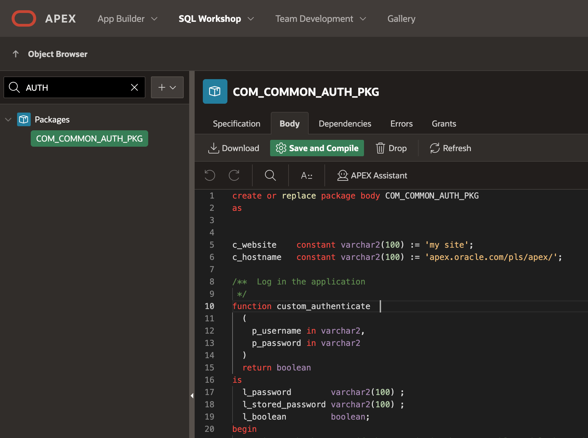
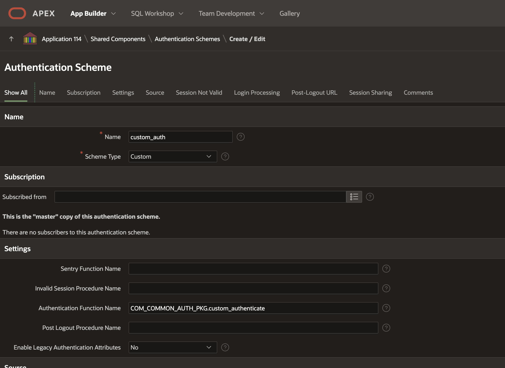
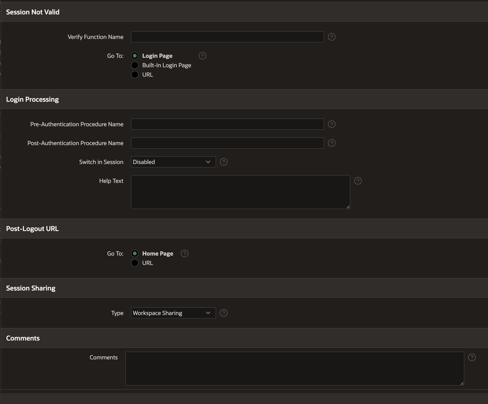
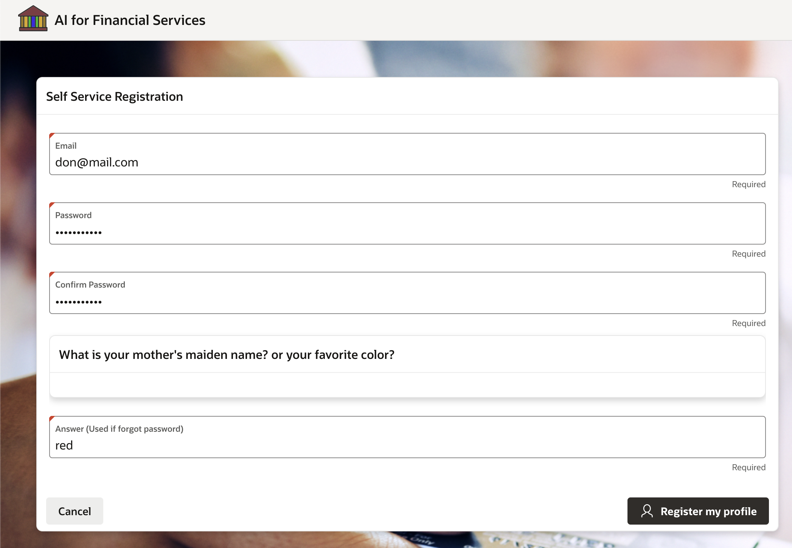
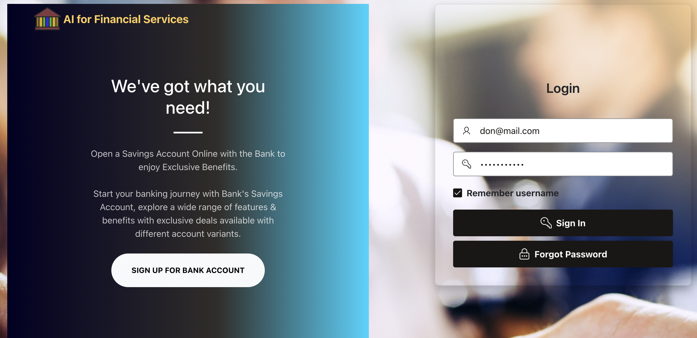
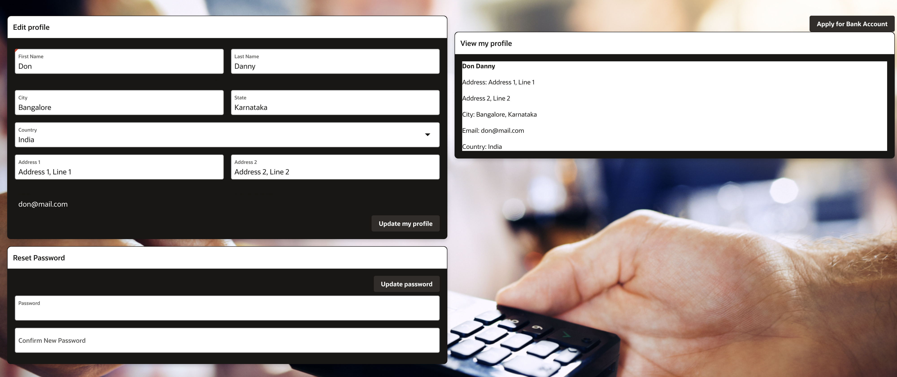

# User Profile Management: Creation and Updates

## About this workshop

TBD

Estimated Time: 30 minutes

---

### Objectives

TBD

---

### Prerequisites

* A user with access to provision & manage core OCI services  
* Having completed common labs

---
 
## Task 1: Create tables and authentication packages

1. Login into Oracle APEX SQL Worksheet. Lets start with creating a sequence **COMMON\_USER\_SEQ**

   

    ```sql 
        <copy>
            CREATE SEQUENCE  COMMON_USER_SEQ  MINVALUE 1 MAXVALUE 9999999999999999999999999999 
            INCREMENT BY 1 START WITH 841 CACHE 20 NOORDER  NOCYCLE  NOKEEP  NOSCALE  GLOBAL ;
        </copy>
    ```

  Click on the **Run** Button
 
## Task 2: Create users table and roles table
 
1.  We have named users table as **COMMON\_USERS** and roles table as **COMMON\_ROLE**. This will help us keep a list of registered users and their corresponding roles. by default all the users registered will be in the **User** role 
   
    ```sql 
        <copy> 
        CREATE TABLE "COMMON_ROLE" 
          (	
              "ROLE_ID" NUMBER GENERATED BY DEFAULT ON NULL AS IDENTITY MINVALUE 1 MAXVALUE 9999999999999999999999999999 
              INCREMENT BY 1 START WITH 1 CACHE 20 NOORDER  NOCYCLE  NOKEEP  NOSCALE  NOT NULL ENABLE, 
              "ROLE_NAME" VARCHAR2(255 CHAR) NOT NULL ENABLE, 
              "ROLE_DESC" VARCHAR2(1000 CHAR), 
              CONSTRAINT "COMMON_ROLE_PK" PRIMARY KEY ("ROLE_ID")
              USING INDEX  ENABLE
          );

        CREATE TABLE "COMMON_USERS" 
          (	
              "USER_ID" NUMBER NOT NULL ENABLE, 
              "EMAIL" VARCHAR2(255), 
              "PASSWORD" VARCHAR2(2000), 
              "VERIFICATION_CODE" VARCHAR2(255), 
              "ROLE_ID" NUMBER, 
              "REFER_URL" VARCHAR2(1000), 
              "REFER_USER_ID" NUMBER, 
              "POINTS" NUMBER, 
              "FIRST_NAME" VARCHAR2(100), 
              "LAST_NAME" VARCHAR2(100), 
              "ADDRESS1" VARCHAR2(255), 
              "ADDRESS2" VARCHAR2(255), 
              "CITY" VARCHAR2(100), 
              "STATEZIP" VARCHAR2(100), 
              "ANSWER" VARCHAR2(50), 
              "COUNTRY" VARCHAR2(20), 
              "GENDER" VARCHAR2(10),  
              CONSTRAINT "COMMON_USER_PK" PRIMARY KEY ("USER_ID")
              USING INDEX  ENABLE
          ) ;

          ALTER TABLE "COMMON_USERS" ADD CONSTRAINT "COMMON_USERS_FK" FOREIGN KEY ("ROLE_ID")  
          REFERENCES "COMMON_ROLE" ("ROLE_ID") ENABLE;
        
          CREATE OR REPLACE EDITIONABLE TRIGGER "BI_COMMON_USERS" 
          before insert on "COMMON_USERS"                
            for each row   
            begin    
                if :NEW."USER_ID" is null then  
                    select "COMMON_USER_SEQ".nextval into :NEW."USER_ID" from sys.dual;  
                end if;  
            end;  
          
        ALTER TRIGGER "BI_COMMON_USERS" ENABLE;
        </copy>
    ```

## Task 3: Insert demo user records and application roles
 
1.  Let us insert few demo roles into **COMMON\_ROLE** table.   
   
    ```sql 
        <copy>
            
        DELETE from COMMON_ROLE;

        INSERT ALL
              INTO COMMON_ROLE (role_id, role_name, role_desc) values (1, 'Administrator', 'Administrator with full access')
              INTO COMMON_ROLE (role_id, role_name, role_desc) values (2, 'Customer', 'Bank Customer')
              INTO COMMON_ROLE (role_id, role_name, role_desc) values (3, 'Doctor', 'Doctor in AI for Healthcare')
              INTO COMMON_ROLE (role_id, role_name, role_desc) values (4, 'User', 'Common User')
              INTO COMMON_ROLE (role_id, role_name, role_desc) values (5, 'Banker', 'Bank Officer in AI for Financial Services')
        SELECT * FROM dual;
        </copy>
    ```

2. Insert few demo users to **COMMON\_USERS** table. 

    ```sql 
        <copy>
        INSERT ALL 
          INTO COMMON_USERS (EMAIL, PASSWORD, ANSWER,) VALUES ('DEMOUSER', 'ECD3722B93FFCD6C4CD35AA07B564535', 'red')
          INTO COMMON_USERS (EMAIL, PASSWORD, ANSWER) VALUES ('Doctor3', 'FB93144A6A2839461D86974D5CE69D8A', 'green')
          INTO COMMON_USERS (EMAIL, PASSWORD, ANSWER) VALUES ('Doctor2', 'FB93144A6A2839461D86974D5CE69D8A', 'white')
          INTO COMMON_USERS (EMAIL, PASSWORD, ANSWER) VALUES ('Patient1', 'FB93144A6A2839461D86974D5CE69D8A', 'blue')
          INTO COMMON_USERS (EMAIL, PASSWORD, ANSWER) VALUES ('Patient2', 'FB93144A6A2839461D86974D5CE69D8A', 'red')
          INTO COMMON_USERS (EMAIL, PASSWORD, ANSWER) VALUES ('BANKER', 'DAAEF850E4310C419C6284DA827D1C8B', 'red')
        SELECT * FROM dual;
        </copy>
    ```

## Task 3: Create Authentication package
 
1.  Authentication package helps us in creating user or user registration, forgot password, assign roles. as shown below
    

2.  Package Specification 
   
    ```sql 
        <copy>
            
        create or replace package COM_COMMON_AUTH_PKG as   
        function custom_authenticate  
          (  
            p_username in varchar2,  
            p_password in varchar2  
          )  
          return boolean;  
        
        procedure create_account(  
            p_email    in varchar2,  
            p_password in varchar2,
            p_answer in varchar2);  

        function forgot_password(  
            p_email in varchar2,  
            p_answer in varchar2) 
            return varchar2  ; 
        
        function verify_reset_password(  
            p_id in number,  
            p_verification_code in varchar2)  
          return number;  
        
        procedure request_reset_password(  
            p_email in varchar2) ;  
        
        procedure mail_reset_password(  
          p_email    in varchar2,  
          p_url      in varchar2) ; 
          
        procedure reset_password(  
            p_id       in number,  
            p_password in varchar2) ; 
        
        function authz_administrator(  
            p_username in varchar2)  
          return boolean ; 
        
        function authz_user(  
            p_username in varchar2)  
          return boolean ; 
        end;
        /
        </copy>
    ```

3.  Package Body 
   
    ```sql 
        <copy>
            create or replace package body COM_COMMON_AUTH_PKG  
            as    
            c_website    constant varchar2(100) := 'my site';  
            c_hostname   constant varchar2(100) := 'apex.oracle.com/pls/apex/';  
            
            /**  Log in the application   */  
            function custom_authenticate  
              (  
                p_username in varchar2,  
                p_password in varchar2  
              )  
              return boolean  
            is  
              l_password        varchar2(100) ;  
              l_stored_password varchar2(100) ;  
              l_boolean         boolean;  
            begin  
              -- First, check to see if the user is in the user table and look up their password  
              select password  
                into l_stored_password  
                from common_users  
              where upper(email) = upper(p_username);  
              -- hash the password the person entered  
              select standard_hash(p_password, 'MD5') into l_password from dual; 
               
              -- Finally, we compare them to see if they are the same and return either TRUE or FALSE  
            if l_password = l_stored_password then  
                return true;  
              else  
                return false;  
              end if;  
            exception  
            when no_data_found then  
              return false;  
            end custom_authenticate;   
            
            
            /**  Register   */  
            procedure create_account(  
                p_email    in varchar2,  
                p_password in varchar2,
                p_answer in varchar2)  
            is  
              l_message varchar2(4000) ;  
              l_password raw(64) ;  
              l_user_id number;  
              l_url  varchar2(1000) ;  
            begin  
              apex_debug.message(p_message => 'Begin create_site_account', p_level => 3);  
              
            -- l_password := utl_raw.cast_to_raw(DBMS_RANDOM.string('x',10));  
            select standard_hash(p_password, 'MD5') into l_password from dual; 
              
              apex_debug.message(p_message => 'verify email exists', p_level => 3) ;  
              
              begin  
                select password  
                  into l_password  
                  from common_users  
                where upper(email) = upper(p_email) ;  
                l_message       := l_message || 'Email address already registered.';  
              
              exception  
              when no_data_found then  
                apex_debug.message(p_message => 'email doesn''t exist yet - good to go', p_level => 3) ;  
              end;  
              
              if l_message is null then  
                apex_debug.message(p_message => 'password ok', p_level => 3) ;  
              
                apex_debug.message(p_message => 'insert record', p_level => 3) ;  
                /* insert return user_id *****/  
                insert into common_users (email, password, role_id, answer)  
                values (p_email, l_password,2, p_answer)   
                returning USER_ID into l_user_id;  
                
                -- create refer url    
                l_url := c_hostname||'f?p='||v('APP_ID')||':9999:0::::p9999_refer_user_id:' || l_user_id ; 
                
                apex_debug.message(p_message => 'update record', p_level => 3) ;  
                
                update common_users 
                set refer_url=l_url 
                where user_id=l_user_id; 
            
              else  
                raise_application_error( -20001, l_message) ;  
              end if;  
                  
              apex_debug.message(p_message => 'End create_site_account', p_level => 3) ;  
            end create_account;  
              
            /**  Post authentication */  
            procedure post_authenticate(  
                p_username in varchar2,  
                out_user_id out number,  
                out_time_zone out varchar2  
            )  
            is  
              l_id         number;  
              l_first_name varchar2(100) ;  
            begin  
              select USER_ID  
                into l_id  
                from common_users  
              where upper(email)    = upper(p_username);  
              out_user_id        := l_id;  
              
            end post_authenticate;  
              
              
            /** Reset password  */  
            procedure request_reset_password(  
                p_email in varchar2)  
            is  
              l_id                number;  
              l_verification_code varchar2(100);  
              l_url               varchar2(200);  
            begin  
              -- First, check to see if the user is in the user table  
              select USER_ID  
                into l_id  
                from common_users  
              where upper(email)    = upper(p_email);  
              
              dbms_random.initialize(to_char(sysdate, 'YYMMDDDSS')) ;  
              l_verification_code := dbms_random.string('A', 20);  
              
              l_url := apex_util.prepare_url
              (p_url => c_hostname||'f?p='||v('APP_ID')||':31:0::::P31_USER_ID,P31_VC:' 
                    || l_id || ',' || l_verification_code, p_checksum_type => 1);  
                
              update common_users  
                set verification_code = 'RESET_' || l_verification_code  
              where user_id = l_id;  
              
              mail_reset_password(p_email => p_email, p_url => l_url);  
              
            exception  
            when no_data_found then  
              raise_application_error( - 20001, 'Email address not registered.') ;  
            end request_reset_password ;  
 
            function forgot_password(
                p_email IN VARCHAR2,
                p_answer IN VARCHAR2)
            RETURN VARCHAR2
            IS
                l_ret_msg VARCHAR2(400);  -- added size to the variable
                l_id number:= 0;
                l_exists NUMBER;
                l_random_password VARCHAR2(10);
                l_chars VARCHAR2(62) := 'ABCDEFGHIJKLMNOPQRSTUVWXYZabcdefghijklmnopqrstuvwxyz0123456789';
                l_hashed_password varchar2(100) ; 
            BEGIN
                l_ret_msg := ' '; 
                
                SELECT CASE
                      WHEN EXISTS ( SELECT USER_ID FROM common_users WHERE upper(email) = upper(p_email) AND upper(answer) = upper(p_answer) ) THEN 1
                      ELSE 0
                    END
              INTO l_exists
              FROM DUAL;

              IF l_exists = 1 THEN
                    FOR i IN 1..10 LOOP
                    l_random_password := l_random_password || SUBSTR(l_chars, DBMS_RANDOM.VALUE(1, LENGTH(l_chars)), 1);
                  END LOOP;
                  --- lets make hash of this password
                  select standard_hash(l_random_password, 'MD5') into l_hashed_password from dual; 
                  -- update password in DB
                  update common_users   set password = l_hashed_password where upper(email) = upper(p_email); 

                  l_ret_msg := 'Your new password is '||l_random_password||' please login and change your password';

                DBMS_OUTPUT.PUT_LINE('Record exists l_random_password '||l_random_password);

              ELSE
                DBMS_OUTPUT.PUT_LINE('Record does not exist');
                l_ret_msg :=  'Sorry, We are unable to find your profile, please create a new login profile from the login page ';
                --or your answer does not match our records
              END IF;

                
            return l_ret_msg;
            END forgot_password;
             
            /**   * Reset password email - use this only if email service is available  */  
            procedure mail_reset_password(  
              p_email    in varchar2,  
              p_url      in varchar2)  

            is  
              l_body     clob;    
            begin  
              apex_debug.message(p_message => 'Reset password demo account', p_level => 3) ;    
              l_body := '<p>Hi,</p>  
                        <p>We received a request to reset your password in the training app.</p>  
                        <p><a href="'||p_url||'">Reset Now.</a></p>  
                        <p>If you did not request this, you can simply ignore this email.</p>  
                        <p>Kind regards,<br/>  
                        </p>';   
              
              apex_mail.push_queue;      
              
            exception  
            when others   
            then  
              raise_application_error( - 20002, 'Issue sending reset password email.') ;  
            end mail_reset_password;  
            
            
            /** Reset Password  */  
            procedure reset_password(  
                p_id       in number,  
                p_password in varchar2)  
            is  
              l_username        varchar2(100) ;  
              l_hashed_password varchar2(100) ;  
            begin  
              select email  
                into l_username  
                from common_users  
              where USER_ID = p_id;  
              
              select standard_hash(p_password, 'MD5') into l_hashed_password from dual; 
              
              update common_users  
                set password = l_hashed_password,  
                    verification_code = null  
              where USER_ID = p_id;  
            end reset_password;  
            
            /** Check the verification code  */  
            function verify_reset_password(  
                p_id in number,  
                p_verification_code in varchar2)  
              return number  
            is  
              l_id number;  
            begin  
              begin 
              select u.USER_ID  
                into l_id  
                from common_users u  
              where u.verification_code = 'RESET_'||p_verification_code  
                and u.USER_ID = p_id;  
              
              return l_id;  
            exception  
              when no_data_found  
              then  
                raise_application_error( - 20001, 'Invalid password request url.') ;  
                l_id:=0; 
                return 0;  
            end; 
            return  l_id; 
            end verify_reset_password ;  
               
            /** check the user is the administrator  */  
            function authz_administrator(  
                p_username in varchar2)  
              return boolean  
            is  
              l_is_admin varchar2(1) ;  
            begin  
              select 'Y'  
                into l_is_admin  
                from common_users a  
              where upper(a.email) = upper(p_username)  
                and a.role_id = 1;  
              --  
              return true;  
            exception  
            when no_data_found then  
              return false;  
            end authz_administrator;  
               
            /** check the username is the account username  */  
            function authz_user(  
                p_username in varchar2)  
              return boolean  
            is  
              l_is_user varchar2(1) ;  
            begin  
              select 'Y'  
                into l_is_user  
                from common_users a  
              where upper(a.email) = upper(p_username)  
                and a.role_id in (1,2);  
              --  
              return true;  
            exception  
            when no_data_found then  
              return false;  
            end authz_user;  
              
            end COM_COMMON_AUTH_PKG;
            /
        </copy>
    ```
 
## Task 4: Add new Authentication scheme

1. Add new **Authentication Scheme** Under Shared Components > Security > Authentication Scheme

     

2. Provide **Authentication Scheme Name** and **Authentication Function Name**

     

3. Provide **Session Not Valid URL** and **Post Logout URL**

     

    Optionally session sharing can be set to **Application** or **Workspace Sharing**

## Task 5: Create self service registration page

1. Create self service registration page

     

## Task 6: Login to the application

1. Login to the application

   

## Task 7: View Home page

1. If login is success, then we can view the application Home page
2. Design of Home Page is not covered in this guide, please import it from the application or create your own home page

   

## Task 8: Create update profile page

1. Create update profile page

   
   
## Acknowledgements

* **Author** - Madhusudhan Rao B M, Principal Product Manager, Oracle Database
* **Last Updated By/Date** - April 4th, 2025

## Learn more
 
* [Oracle Digital Assistant Skills](https://docs.oracle.com/en/cloud/paas/digital-assistant/use-chatbot/create-configure-and-version-skills1.html)
