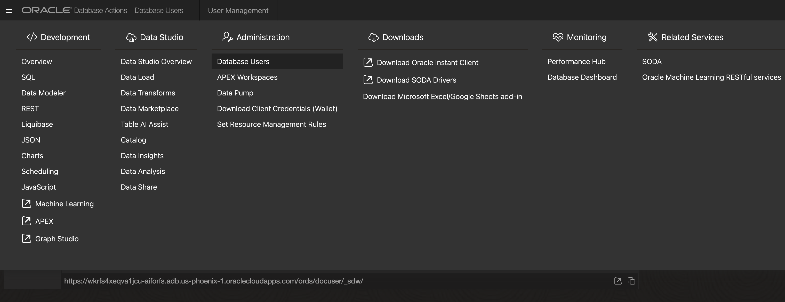
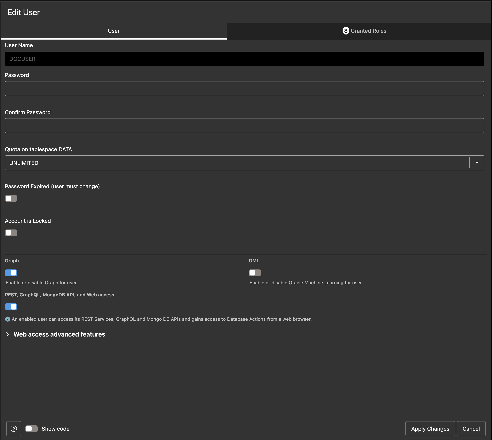
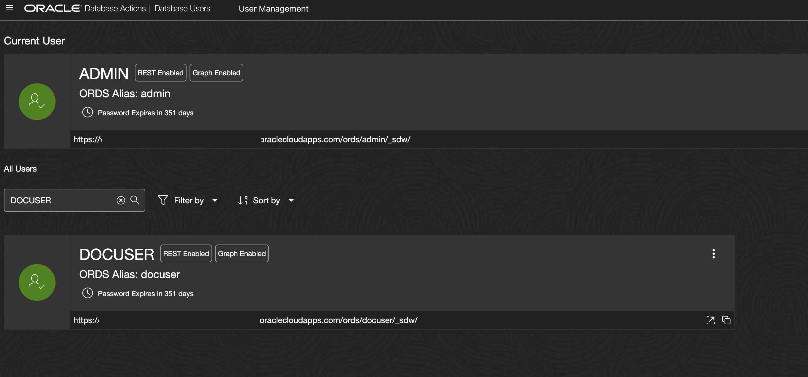
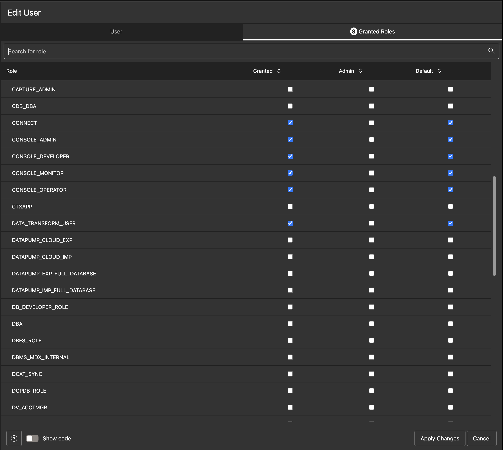
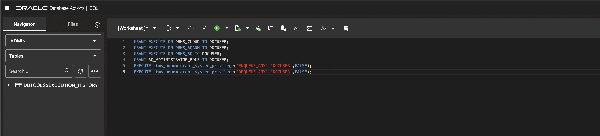
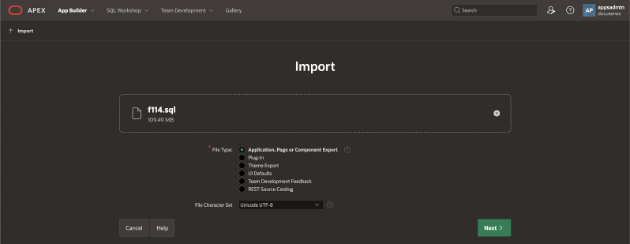
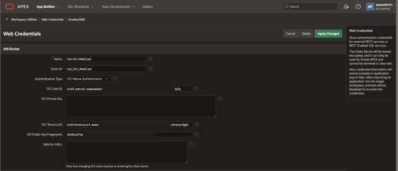
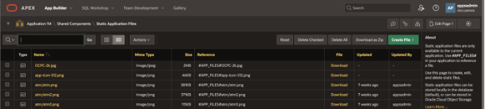
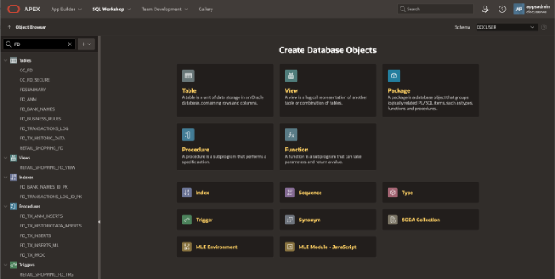
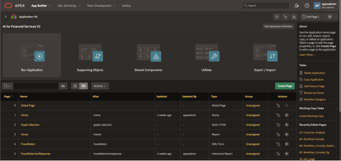

# Application Deployment Guide

## About this workshop

This guide provides step-by-step instructions for deploying an Oracle Application Express (APEX) application AI for Financial Services. The guide covers the deployment process, including preparation, configuration, and troubleshooting.
 
Estimated Time: 30 minutes

---

### Objectives

Deploy AI for Financial Services application in your own tenancy.

---

### Prerequisites

Before deploying your APEX application, ensure you have:
  
- Completed application development: Verify that your application is complete, tested, and ready for deployment.
- Created a deployment package: Package your application using the APEX Export feature.
- Identified deployment targets: Determine the target environment(s) for your deployment, such as production, staging, or testing.
- Gathered necessary credentials: Collect the required credentials for the target environment, including database credentials and APEX administrator credentials.
 
---

## Task 1: Create Database User, Provide Grants

1. Login to Oracle Autonomous Database Cloud Console, Select All Database Actions 
2. Select Administration and Database Users, Create a Database user, in this case we are creating a DB user as "DOCUSER" 
     
3. Enable Graph, REST and OML users, Quota can be unlimited.
    
4. View and Edit Database User details as required. 
   
4. **Grant** the required **Roles** 
    
5. We can also use SQL worksheet to grant any other missing roles that are required by the application as shown below.  
    
  
## Task 2: Import Application

1. Log in to the target environment's APEX instance as an administrator.
2. Navigate to the **App Builder** page.
3. Click **Import** and select the zip file downloaded. please see Task 7 of this lab
4. Follow the **Import** wizard to complete the import process.
   
    

5. Ensure that Database Objects are created, that is the tables, views, triggers, sequences, packages, functions, types etc.
6. Check if there are any import issues
 
## Task 3: Configure the Application
  
1. Configure authentication: Set up authentication schemes, such as Oracle APEX authentication or custom authentication. 
2. Configure OCI web credentials under Workshop Utilities > **Web Credentials**

     
 
## Task 4: Verify Static Files imported

1. Verify static files imported such as images, CSS, and JavaScript files, to the target environment.
  
     

## Task 5: Verify the Database Tables and Data

1. Browse the database objects such as functions, tables, procedures, packages, etc have been imported along with the required data for database tables, and ensure that the database user has required grants to view and update these database objects.
     
     

## Task 6: Test the Application

1. Verify application functionality: Test the application to ensure it functions correctly.
2. Test authentication and authorization: Verify that authentication and authorization schemes are working correctly.
3. Test static files: Verify that static files are being served correctly.

     
     

## Task 7: Troubleshooting

1. Common issues and solutions
2. Application not importing correctly: Check the import log for errors and verify that the deployment package is correct.
3. Authentication not working: Verify that authentication schemes are configured correctly and that credentials are correct.
4. Static files not being rendered: Check that static files are uploaded correctly and that static file storage is configured correctly.
  
## Task 8: Download Source Code

1. Download the [Application source code](https://github.com/madhusudhanrao-ppm/developer/tree/main/ai-for-financialservices/source/f114) 
2. Create a zip file f114.zip from the source code files. where 114 is application id
3. Import the application zip file from Oracle APEX Application Import feature. 

Please Note: Some of the source files will need to replaced with your compartment id, image locations, tenancy ocid, model ocid, APEX web credentials, etc to get this working as it would change from one tenancy to another.  -->

## Acknowledgements

* **Author** - Madhusudhan Rao B M, Principal Product Manager, Oracle Database
* **Last Updated By/Date** - May 19th, 2025

## Learn more
 
* [Migrating Oracle APEX Applications Across Workspaces](https://www.linkedin.com/pulse/migrating-oracle-apex-applications-across-workspaces-madhusudhan-rao-qzssf)
