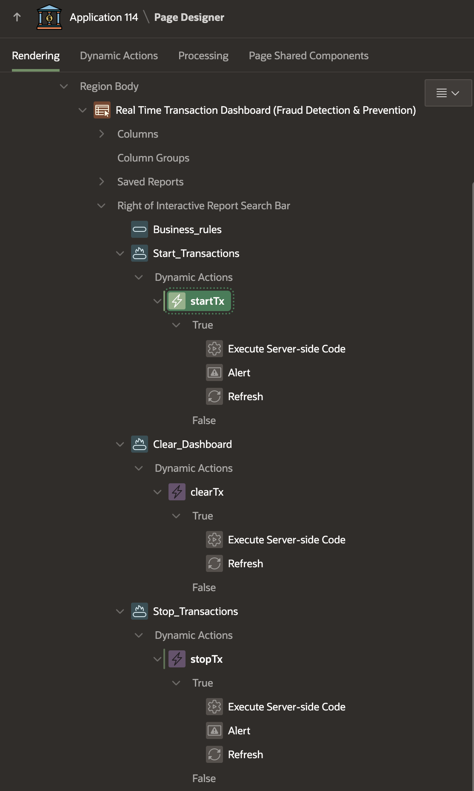
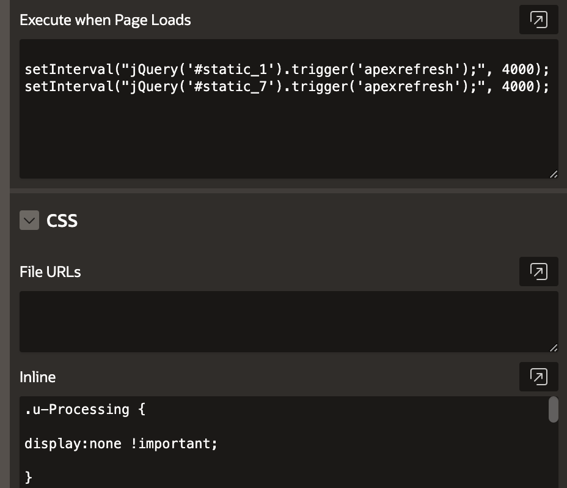
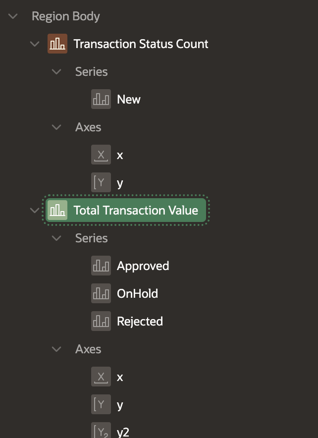
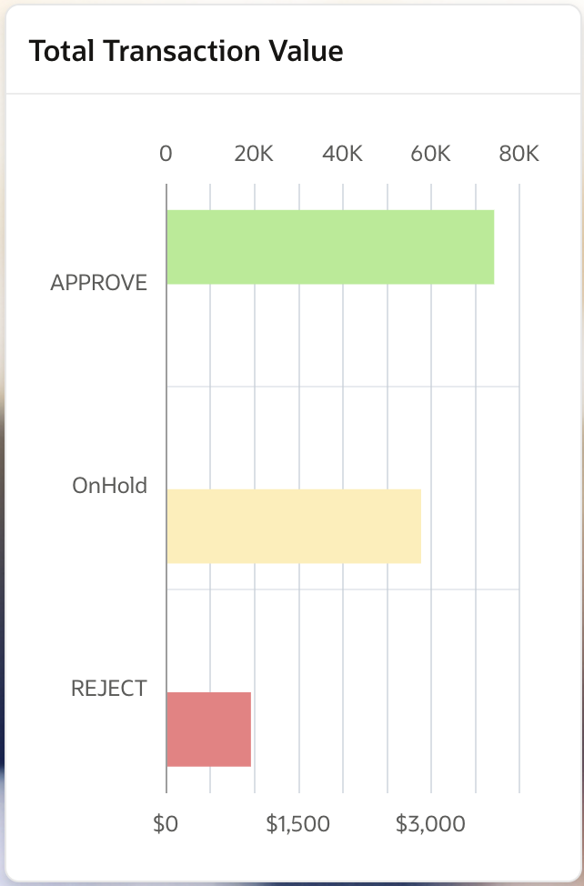

# Fraud Detection and Alerts: Identifying Suspicious Credit Card Activity

## About this workshop

Welcome to this workshop on building a comprehensive Fraud Detection System! In this hands-on session, you'll learn how to design and develop a robust system that can identify and flag potential fraudulent activities. You'll gain practical experience in creating database tables, developing business rules, automating tasks, and designing a user-friendly dashboard with real-time charts and visualizations.

Estimated Time: 30 minutes

---

### Objectives

By the end of this workshop, participants will be able to:

- Design and implement database tables for storing transaction data.
- Develop and apply business rules for detecting fraudulent transactions.
- Configure scheduler jobs to automate fraud detection tasks.
- Create a user interface dashboard for monitoring and analyzing fraud detection results.
- Design and implement charts and visualizations to effectively communicate fraud detection insights.
- Implement page refresh and auto-chart refresh functionality for real-time updates.

---

### Prerequisites

* A user with access to provision & manage core OCI services  
* Having completed common labs

--- 
 
### Introduction to this Lab

 [Demo video on AI for Financial Services](youtube:qEjNMRoVGjM:large) 

In this lab, you'll design and develop a comprehensive fraud detection system by completing the following tasks:

 -  Creating database tables and triggers
 -  Developing business rules and logic for fraud detection
 -  Configuring scheduler jobs for automation
 -  Designing a user interface dashboard
 -  Implementing real-time updates
 -  Creating fraud detection charts
  
By completing these tasks, you'll gain hands-on experience in building a robust fraud detection system that can identify and flag potential fraudulent activities.

<!-- [Demo video on AI for Financial Services](youtube:PIaUq2lP1Og:large)  -->

---
 
## Task 1: Database Table & Trigger Creation

1. Design and create database tables to support fraud detection analytics. 
2. Create **BANK\_TRANSFERS** Table

    ```sql 
      <copy>
      BEGIN 
          CREATE TABLE "BANK_TRANSFERS" 
          (	
            "TXN_ID" NUMBER, 
            "SRC_ACCT_ID" NUMBER, 
            "DST_ACCT_ID" NUMBER, 
            "DESCRIPTION" VARCHAR2(400), 
            "AMOUNT" NUMBER, 
            "PROFILE" VARCHAR2(20), 
            "INV_NO" VARCHAR2(50), 
            "MERCHANT_REGION" VARCHAR2(100), 
            "MERCHANT_STATE" VARCHAR2(100), 
            "MERCHANT_PLACE" VARCHAR2(100), 
            PRIMARY KEY ("TXN_ID")
            USING INDEX  ENABLE
          ) ;

          ALTER TABLE "BANK_TRANSFERS" ADD FOREIGN KEY ("SRC_ACCT_ID")
            REFERENCES "BANK_ACCOUNTS" ("ID") ENABLE;
          ALTER TABLE "BANK_TRANSFERS" ADD FOREIGN KEY ("DST_ACCT_ID")
            REFERENCES "BANK_ACCOUNTS" ("ID") ENABLE;
      END;
      </copy>
    ```  

3. Create **CC_FD** Table, This will hold credit card details related to customer (customer id)

    ```sql 
      <copy>
        CREATE TABLE "CC_FD" 
        (	
          "ID" NUMBER GENERATED BY DEFAULT ON NULL AS IDENTITY MINVALUE 1 MAXVALUE 9999999999 
              INCREMENT BY 1 START WITH 1 CACHE 20 NOORDER  NOCYCLE  NOKEEP  NOSCALE  NOT NULL ENABLE, 
          "CUST_ID" NUMBER, 
          "CC_NO" NUMBER, 
          "STATUS" VARCHAR2(50), 
          "VALIDITY" DATE, 
          "FIRST_NAME" VARCHAR2(50), 
          "LAST_NAME" VARCHAR2(50), 
          "BANK_NAME" VARCHAR2(50), 
          "COMMENTS" VARCHAR2(100), 
          "CARD_TYPE" VARCHAR2(10), 
          PRIMARY KEY ("ID") USING INDEX  ENABLE
        ) ;
      </copy>
    ```  

4. Create Table **RETAIL\_SHOPPING\_FD**

    ```sql 
      <copy>
      CREATE TABLE "RETAIL_SHOPPING_FD" 
      (	
        "ID" NUMBER GENERATED BY DEFAULT ON NULL AS IDENTITY MINVALUE 1 MAXVALUE 9999999 
          INCREMENT BY 1 START WITH 1 CACHE 20 NOORDER  NOCYCLE  NOKEEP  NOSCALE  NOT NULL ENABLE, 
        "INV_NO" VARCHAR2(50), 
        "GENDER" VARCHAR2(50), 
        "AGE" NUMBER, 
        "CATEGORY" VARCHAR2(50), 
        "QTY" NUMBER, 
        "PRICE" NUMBER, 
        "TOTAL_PAY" NUMBER, 
        "METHOD" VARCHAR2(50), 
        "INV_DATE" TIMESTAMP (6), 
        "MALL" VARCHAR2(50), 
        "CUST_ID" NUMBER, 
        "CUST_FIRST_NAME" VARCHAR2(100), 
        "CUST_LAST_NAME" VARCHAR2(100), 
        "CREDIT_CARD_NO" NUMBER, 
        "TRANS_STATUS" VARCHAR2(20), 
        "CUST_CITY" VARCHAR2(100), 
        "CUST_STATE_PROVINCE" VARCHAR2(100), 
        "TRANSACTION_STATUS" VARCHAR2(50), 
        "COMMENTS" VARCHAR2(500), 
        "COUNTRY_ID" VARCHAR2(50), 
        "TX_TIMESTAMP" TIMESTAMP (6), 
        "MERCHANT_ID" NUMBER, 
        "MERCHANT_CITY" VARCHAR2(50), 
        "MERCHANT_REGION" VARCHAR2(255), 
        "MERCHANT_STATE" VARCHAR2(100), 
        "MERCHANT_PLACE" VARCHAR2(100), 
        "LONGITUDE" NUMBER, 
        "LATITUDE" NUMBER, 
        "MERCHANT_PLACE_ID" NUMBER, 
        "CUSTOMER_FULLNAME" VARCHAR2(50), 
        "MERCHANT_FULLNAME" VARCHAR2(50), 
        "INV_TIMESTAMP" TIMESTAMP (6) WITH LOCAL TIME ZONE, 
        "CC_ID" NUMBER, 
        "TIME_DIFFERENCE_NUMBER" NUMBER, 
        "TX_TYPE" VARCHAR2(20), 
        "WORKFLOW_STATUS" VARCHAR2(100), 
        PRIMARY KEY ("ID") USING INDEX  ENABLE
      ) ;
      </copy>
    ```  

5. Create trigger **RETAIL\_SHOPPING\_FD\_TRG**

    ```sql 
      <copy>
      CREATE OR REPLACE EDITIONABLE TRIGGER "RETAIL_SHOPPING_FD_TRG" 
      before 
      insert on "RETAIL_SHOPPING_FD"  
      for each row 
      declare 
              v_ccid number; 
              v_n number := 0; 
              v_min_time_diff_number number; 
              v_min_tx_value number; 
              v_max_tx_value number; 
      begin 
      
          SELECT unit_value into v_min_time_diff_number from FD_BUSINESS_RULES where unit = 'Minimum Time Frequency'; 
          SELECT unit_value into v_min_tx_value from FD_BUSINESS_RULES where unit = 'Approved Purchase'; 
          SELECT unit_value into v_max_tx_value from FD_BUSINESS_RULES where unit = 'Rejected Purchase'; 
      
          SELECT id 
            INTO v_ccid  
            FROM cc_fd 
          WHERE cc_no = :new.credit_card_no;    
          if inserting then 
              if :new.total_pay < v_min_tx_value then 
                      :new.transaction_status := 'APPROVE'; 
                      :new.comments := 'Lower than minimum amount of $ '||v_min_tx_value||''; 
              elsif :new.total_pay >= v_min_tx_value AND :new.total_pay < v_max_tx_value then 
                      :new.transaction_status := 'OnHold'; 
                      :new.trans_status := 'UNREAD'; 
              else  
                      :new.transaction_status := 'REJECT'; 
                      :new.comments := 'Higher than allowed amount of $ '||v_max_tx_value||''; 
              end if;  
              :new.cc_id := v_ccid;     
        end if;      
          
      end;
      /
      ALTER TRIGGER "RETAIL_SHOPPING_FD_TRG" ENABLE;
      </copy>
    ```  

## Task 2: Business Rule Development
 
1. Create and configure business rules to identify and flag potential fraud.
 
2. Following Business rules are applied in this Lab.
   
  **Rule 1 (Based on Transaction Value)**

     - If Transaction Amount < 2000. Transaction is **Auto Approved**
     - If Transaction Amount >= 2000 and < 10,000. Transaction is kept **OnHold** for a manual review
     - If Transaction Amount >= 10000. Transaction is **Rejected** and the card is **Blocked** from Further Transactions
  
  **Rule 2 (Based on Location)** 

     - If the same credit card is used in less than **15 seconds** in different locations, then that transaction will be **Rejected**.
 
  **Rule 3**

     - If the same credit card is used in more than **15 seconds** in the same locations AND If Transaction Amount >= 2000 and < 10,000. It is **OnHold**, then that card will NOT be blocked.
  
  **Rule 4 (Based on Time)**

  - The same credit card has been used in less than 15, then the transaction is **Rejected** and then the card is **Blocked**.

## Task 3: Business Logic for Fraud Detection

1. In this code snippet, we are simulating PL/SQL-based business logic to detect fraud. Alternatively, we can also use Machine learning-based Business logic or let Anomaly Detection AI service-trained models find fraud in transactions.
2. Insert Random Transactions when the Scheduler Job starts

      ```sql 
        <copy>
        create or replace PROCEDURE FD_TX_INSERTS  
        AS  
          v_INV_NO RETAIL_SHOPPING_FD.INV_NO%TYPE;
          v_CATEGORY RETAIL_SHOPPING_FD.CATEGORY%TYPE;
          v_TOTAL_PAY RETAIL_SHOPPING_FD.TOTAL_PAY%TYPE; 
          v_CUST_ID RETAIL_SHOPPING_FD.CUST_ID%TYPE;
          v_MERCHANT_ID RETAIL_SHOPPING_FD.MERCHANT_ID%TYPE;
          v_CUSTOMER_FULLNAME RETAIL_SHOPPING_FD.CUSTOMER_FULLNAME%TYPE; 
          v_MERCHANT_FULLNAME RETAIL_SHOPPING_FD.MERCHANT_FULLNAME%TYPE;  
          v_MERCHANT_PLACE_ID   RETAIL_SHOPPING_FD.MERCHANT_PLACE_ID%TYPE; 
          v_MERCHANT_PLACE   RETAIL_SHOPPING_FD.MERCHANT_PLACE%TYPE; 
          v_LONGITUDE   RETAIL_SHOPPING_FD.LONGITUDE%TYPE;
          v_LATITUDE   RETAIL_SHOPPING_FD.LATITUDE%TYPE; 
          v_MERCHANT_REGION   RETAIL_SHOPPING_FD.MERCHANT_REGION%TYPE := 'Europe and North America';
          v_MERCHANT_STATE   RETAIL_SHOPPING_FD.MERCHANT_STATE%TYPE := 'United States of America';  
          v_MALL  RETAIL_SHOPPING_FD.MALL%TYPE;
          v_CREDIT_CARD_NO   RETAIL_SHOPPING_FD.CREDIT_CARD_NO%TYPE; 
          v_TX_TIMESTAMP   RETAIL_SHOPPING_FD.TX_TIMESTAMP%TYPE; 
          v_GENDER  RETAIL_SHOPPING_FD.GENDER%TYPE; 
          v_AGE  RETAIL_SHOPPING_FD.AGE%TYPE;  
          v_rand_no number;
          v_which_country number;
        BEGIN
          -- Generate Random transactions in random locations    
          v_TOTAL_PAY := round(DBMS_Random.Value(1,11000),0);  -- Transaction Amount
          v_INV_NO := 'INV-RAND_'||v_TOTAL_PAY;                -- Invoice Number for Transaction
          v_CUST_ID := round(DBMS_Random.Value(1,40),0);       -- Random customer id

          select distinct FIRST_NAME||' '||LAST_NAME, GENDER, AGE into v_CUSTOMER_FULLNAME, v_GENDER, v_AGE from FINBANK_ACCOUNTS 
          where id = v_CUST_ID;
          v_MERCHANT_ID := round(DBMS_Random.Value(1,40),0);

          select distinct FIRST_NAME||' '||LAST_NAME, GENDER, AGE into v_MERCHANT_FULLNAME, v_GENDER, v_AGE from FINBANK_ACCOUNTS 
          where id = v_MERCHANT_ID; 
          SELECT category into v_CATEGORY FROM ( select distinct category  from RETAIL_SHOPPING  ORDER BY DBMS_RANDOM.RANDOM) 
          WHERE  rownum < 2; 

          -- Transaction happening in which country?
          v_which_country := round(DBMS_Random.Value(1,6),0); 
          if (v_which_country <= 4) then 
                  select  ID, NAME_EN, LONGITUDE, LATITUDE into v_MERCHANT_PLACE_ID,  
                  v_MERCHANT_PLACE, v_LONGITUDE, v_LATITUDE
                  from (select ID, NAME_EN, LONGITUDE, LATITUDE  from UNESCO_SITES 
                  where REGION_EN = 'Europe and North America' AND STATES_NAME_EN = 'United States of America' 
                  ORDER BY DBMS_RANDOM.RANDOM) WHERE  rownum < 2;  
            else  
                  select  ID, NAME_EN, LONGITUDE, LATITUDE , REGION_EN, STATES_NAME_EN  
                  into v_MERCHANT_PLACE_ID, v_MERCHANT_PLACE, v_LONGITUDE, v_LATITUDE, v_MERCHANT_REGION, v_MERCHANT_STATE
                  from 
                  (select ID, NAME_EN, LONGITUDE, LATITUDE, REGION_EN, STATES_NAME_EN  from UNESCO_SITES 
                  ORDER BY DBMS_RANDOM.RANDOM) WHERE  rownum < 2;  
          end if;  
                
          -- Select place of transaction, in this case we are considering shopping malls 
          select  mall into v_MALL from 
          (select distinct mall from RETAIL_SHOPPING where mall is not null ORDER BY DBMS_RANDOM.RANDOM) WHERE  rownum < 2;
          select  CC_NO into v_CREDIT_CARD_NO from (select CC_NO from CC_FD where STATUS = 'Active' 
          ORDER BY DBMS_RANDOM.RANDOM) WHERE  rownum < 2;

          -- Generate random time of transaction around the current timestamp
          v_rand_no := round(DBMS_Random.Value(1,59),0);  
          v_TX_TIMESTAMP := current_timestamp + numToDSInterval( v_rand_no, 'second' ); 

          -- Insert transactions into RETAIL_SHOPPING_FD table
          INSERT INTO RETAIL_SHOPPING_FD 
            (
              INV_NO, CATEGORY, TOTAL_PAY, MALL, CUST_ID, 
              CREDIT_CARD_NO, TX_TIMESTAMP, MERCHANT_ID, MERCHANT_REGION, 
              MERCHANT_STATE, MERCHANT_PLACE, LONGITUDE, LATITUDE, 
              MERCHANT_PLACE_ID, CUSTOMER_FULLNAME, MERCHANT_FULLNAME, GENDER, AGE,
              TX_TYPE 
            ) 
            values
            (
              v_INV_NO, v_CATEGORY, v_TOTAL_PAY, v_MALL, v_CUST_ID, 
              v_CREDIT_CARD_NO,  v_TX_TIMESTAMP,  v_MERCHANT_ID, v_MERCHANT_REGION, 
              v_MERCHANT_STATE, v_MERCHANT_PLACE, v_LONGITUDE, v_LATITUDE, 
              v_MERCHANT_PLACE_ID, v_CUSTOMER_FULLNAME,  v_MERCHANT_FULLNAME, v_GENDER, v_AGE,
              'FDTX'  --- Non money laundering related transactions 
            );

          -- 'BEGIN INSERT INTO BANK TRANSFERS  
          INSERT INTO BANK_TRANSFERS (TXN_ID, SRC_ACCT_ID, DST_ACCT_ID, AMOUNT, DESCRIPTION) 
          values ( EMP_SEQ.NEXTVAL , v_CUST_ID, v_MERCHANT_ID, v_TOTAL_PAY, 'FDTX');
              
        END;
        /
        </copy>
    ```  
  
3. Apply Business logic on generated transactions to detect fraud
4. Update Transactions when the Scheduler Job starts

    ```sql 
        <copy>
        create or replace Function my_dashboard ( name_in IN varchar2 ) RETURN number
        IS
        -- Apply Business logic on generated transactions, name_in is not a required IN parameter can be remove or used in future
          v_id number;
          v_total_pay number;
          v_this_credit_card varchar2(50);
          v_previous_card  varchar2(50);
          v_this_mall varchar2(50);
          v_previous_mall varchar2(50);
          v_time_diff_number number;
          v_comment varchar2(500);
          v_credit_card_no varchar2(50);
          v_category varchar2(50);
          v_trans_status varchar2(50);
          v_min_time_diff_number number;
          v_min_tx_value number;
          v_max_tx_value number;
  
        -- Get current transaction and previous transaction 
          Cursor C1 IS   
            SELECT t.id, t.inv_no, t.total_pay, trans_status, comments, transaction_status,CATEGORY,  
            CREDIT_CARD_NO this_credit_card, 
            LAG(CREDIT_CARD_NO) OVER (ORDER BY id) AS Prev_card, 
            MALL this_mall, 
            LAG(MALL) OVER (ORDER BY id) AS prev_mall,  
            to_char(TX_TIMESTAMP,'dd/mm/yyyy hh24:mi:ss') Curr_Timestamp,   
            LAG(to_char(TX_TIMESTAMP,'dd/mm/yyyy hh24:mi:ss')) OVER (ORDER BY id)  Prev_Timestamp, 
            t.TX_TIMESTAMP - LAG(t.TX_TIMESTAMP) OVER (ORDER BY t.TX_TIMESTAMP) AS time_difference, 
            (LAG(to_char(TX_TIMESTAMP,'yyyymmddHH24MISS')) OVER (ORDER BY id)  - to_char(TX_TIMESTAMP,'yyyymmddHH24MISS') ) 
            AS time_diff_number 
            FROM RETAIL_SHOPPING_FD t  
            order by id desc;
  
        BEGIN 

          SELECT unit_value into v_min_time_diff_number from FD_BUSINESS_RULES where unit = 'Minimum Time Frequency';
          SELECT unit_value into v_min_tx_value from FD_BUSINESS_RULES where unit = 'Approved Purchase';
          SELECT unit_value into v_max_tx_value from FD_BUSINESS_RULES where unit = 'Rejected Purchase';

          For row_1 In C1 Loop
            v_id := row_1.id; 
            v_time_diff_number := abs(row_1.time_diff_number);
            v_comment := row_1.comments; 
            v_total_pay := row_1.total_pay; 
            v_category := row_1.category; 
            v_this_mall := row_1.this_mall;
            v_previous_mall := row_1.prev_mall;
            v_trans_status := row_1.trans_status;
            v_this_credit_card := row_1.this_credit_card; 
            
            if   (v_time_diff_number <= v_min_time_diff_number AND v_comment is null)  
              then 
              v_comment := 'The same credit card has been reused in less than '||v_min_time_diff_number||' seconds and '||v_this_credit_card||' is blocked'; 
              UPDATE RETAIL_SHOPPING_FD 
              SET COMMENTS = v_comment, TIME_DIFFERENCE_NUMBER = v_time_diff_number, 
              TRANSACTION_STATUS='REJECT', TRANS_STATUS = 'REJECT' 
              WHERE ID = v_id   
              AND (TRANS_STATUS != 'UNDER REVIEW' OR  TRANS_STATUS != 'REVIEW COMPLETED'); 
              ----------- Block credit card ------------------
              UPDATE CC_FD SET STATUS='Blocked', COMMENTS='Card Auto Blocked' WHERE CC_NO = v_this_credit_card;  
              ------------------------------------------------------- 
            elsif   (v_time_diff_number > v_min_time_diff_number AND v_comment is null AND  v_total_pay >= v_max_tx_value)  
              then 
              v_comment := 'Exceeds max allowed amount of $ '||v_max_tx_value||' for '||v_category||' '; 
              UPDATE RETAIL_SHOPPING_FD 
              SET COMMENTS = v_comment, TIME_DIFFERENCE_NUMBER = v_time_diff_number, TRANSACTION_STATUS='REJECT'  
              WHERE ID = v_id  
              AND (TRANS_STATUS != 'UNDER REVIEW' OR  TRANS_STATUS != 'REVIEW COMPLETED'); 
              ------------------------------------------------------- 
            elsif   (v_time_diff_number > v_min_time_diff_number AND v_comment is null AND v_total_pay >= v_min_tx_value 
              AND  v_total_pay < v_max_tx_value AND (v_this_mall = v_previous_mall) )  
              then 
              v_comment := 'Higher than normal amount of $ '||v_min_tx_value||' for '||v_category||' in same location '; 
              UPDATE RETAIL_SHOPPING_FD SET COMMENTS = v_comment, TIME_DIFFERENCE_NUMBER = v_time_diff_number,  
              TRANSACTION_STATUS='OnHold'  
              WHERE ID = v_id 
              AND (TRANS_STATUS != 'UNDER REVIEW' OR  TRANS_STATUS != 'REVIEW COMPLETED');  
              ------------------------------------------------------- 
            elsif   (v_time_diff_number > v_min_time_diff_number AND v_comment is null AND  v_total_pay >= v_min_tx_value 
              AND  v_total_pay < v_max_tx_value AND  (v_this_mall != v_previous_mall) )  
              then  
              v_comment := 'Higher than normal amount of $2000 '||v_category||' Location:Different '; 
              UPDATE RETAIL_SHOPPING_FD SET COMMENTS = v_comment, TIME_DIFFERENCE_NUMBER = v_time_diff_number,  
              TRANSACTION_STATUS='OnHold'   
              WHERE ID = v_id  
              AND (TRANS_STATUS != 'UNDER REVIEW' OR  TRANS_STATUS != 'REVIEW COMPLETED'); 
              ------------------------------------------------------- 
            elsif   (v_time_diff_number > v_min_time_diff_number AND v_comment is null AND 
              v_total_pay <= 2000 AND (v_this_mall = v_previous_mall) )  
              then 
              v_comment := 'Valid amount for '||v_category||' Location:Same '; 
              UPDATE RETAIL_SHOPPING_FD SET COMMENTS = v_comment, TIME_DIFFERENCE_NUMBER = v_time_diff_number, 
              TRANSACTION_STATUS='APPROVE', TRANS_STATUS = 'APPROVE' 
              WHERE ID = v_id  
              AND (TRANS_STATUS != 'UNDER REVIEW' OR  TRANS_STATUS != 'REVIEW COMPLETED'); 
              ------------------------------------------------------- 
            end if;

          End Loop; 

          return (1); 

        END;
        /
        </copy>
    ``` 

5. Lets apply business logic for each transaction row, rather than all rows together 

    ```sql 
      <copy>
      create or replace procedure FD_TX_PROC is 
          v_myname varchar2(20) := ''; -- for future use, not required
          v_n number;
      begin
        v_n := my_dashboard ( v_myname );
      end;
      /
      </copy>
    ```  

## Task 4: Scheduler Job Configuration
 
1. Set up scheduler jobs to automate fraud detection tasks and processes.
2. Scheduler Job to create random transactions

      ```sql 
      <copy>
      begin
        dbms_scheduler.create_job (
          job_name           =>  'RealTime_TX_Job',
          job_type           =>  'STORED_PROCEDURE',
          job_action         =>  'FD_TX_INSERTS',
          start_date         =>  systimestamp, 
          repeat_interval    =>  'freq=SECONDLY; interval = 20;',
          enabled            =>  true,
          comments           => 'Scheduler Job to create random transactions'
        );
      end;
      </copy>
    ```  

3. Scheduler Job to apply business logic

    ```sql 
      <copy>
      begin
      dbms_scheduler.create_job (
        job_name           =>  'My_Tx_Job',
        job_type           =>  'STORED_PROCEDURE',
        job_action         =>  'FD_TX_PROC',
        start_date         =>  systimestamp, 
        repeat_interval    =>  'freq=minutely; interval = 1;',
        enabled            =>  true,
        comments           => 'Scheduler Job to apply business logic'
      );
    end;
      </copy>
    ```  
 
## Task 5: User Interface Dashboard

1. Design and develop a user-friendly dashboard to display fraud detection insights.

    

2. Add buttons on Oracle APEX page with Dynamic Actions listed below 

   

3. Start Transaction Generation Jobs
   
    ```sql 
      <copy>
      begin 
        DBMS_SCHEDULER.ENABLE( 'RealTime_TX_Job');
        DBMS_SCHEDULER.ENABLE( 'MY_TX_JOB');
      end;
      </copy>
    ```  

4. Stop Transaction Generation Jobs

    ```sql 
      <copy>
      begin 
        DBMS_SCHEDULER.DISABLE( 'RealTime_TX_Job',TRUE );
        DBMS_SCHEDULER.DISABLE( 'MY_TX_JOB',TRUE ); 
      end;
      </copy>
    ```  

5. Clear Generated Transactions 

    ```sql 
      <copy>
      begin 
        delete from RETAIL_SHOPPING_FD where TX_TYPE = 'FDTX' ;
        delete from BANK_TRANSFERS; 
        UPDATE CC_FD SET STATUS = 'Active';
      end;
      </copy>
    ``` 
      
## Task 6: Real-Time Update Implementation
 
1. Create Interactive Report with following SQL query to get latest transactions.

    ```sql 
      <copy>
      SELECT t.id, t.inv_no as Invoice, '$ '||t.total_pay as Amount, 
        trans_status, comments, transaction_status as Status,
        category,time_difference_number,merchant_state, merchant_place,
        CREDIT_CARD_NO as Card,  LAG(CREDIT_CARD_NO) OVER (ORDER BY id) AS Prev_card, 
        MALL Place,  LAG(MALL) OVER (ORDER BY id) AS Prev_mall,  
        to_char(TX_TIMESTAMP,'dd/mm/yyyy hh24:mi:ss') Curr_Timestamp,   
        LAG(to_char(TX_TIMESTAMP,'dd/mm/yyyy hh24:mi:ss')) OVER (ORDER BY id)  Prev_Timestamp, 
        t.TX_TIMESTAMP - LAG(t.TX_TIMESTAMP) OVER (ORDER BY t.TX_TIMESTAMP) 
        AS time_difference, 
        abs(LAG(to_char(TX_TIMESTAMP,'yyyymmddHH24MISS')) OVER (ORDER BY id)  - to_char(TX_TIMESTAMP,'yyyymmddHH24MISS') ) 
        AS  time_diff_number  
      FROM RETAIL_SHOPPING_FD t 
        WHERE TX_TYPE = 'FDTX'  
      ORDER BY id desc 
      </copy>
    ``` 

2. Implement page refresh and auto-chart refresh functionality for real-time monitoring.
3. Red indicates Rejected transactions, Yellow OnHold Transactions and Green Approved Transactions. 
4. We can use Interactive Report color **Format > Highlight** to show different rows in different colors based on transaction status.

   

3. Inline Javascript

    ```javascript 
      <copy> 
        /* Static Id static_1 of Interactive Grid with Refresh Interval */
        setInterval("jQuery('#static_1').trigger('apexrefresh');", 4000); 
        setInterval("jQuery('#static_7').trigger('apexrefresh');", 4000);  
      </copy>
    ``` 

4. Inline Stylesheet 

    ```stylesheet 
      <copy>
      .u-Processing { 
        display:none !important; 
      } 
      </copy>
    ```  

## Task 7: Fraud Detection Chart Creation
 
1. Create charts and visualizations to effectively communicate fraud detection results.

     

2. Corresponding SQL query will be as follows

    ```sql 
      <copy> 
        select TRANSACTION_STATUS, count(*) TRANSACTION_COUNT, sum(total_pay) as TRANSACTION_TOTAL 
        from RETAIL_SHOPPING_FD 
        WHERE TRANSACTION_STATUS = 'APPROVE' AND TX_TYPE = 'FDTX'  group by TRANSACTION_STATUS 
      </copy>
    ``` 
   
    
 
## Acknowledgements

* **Author** - Madhusudhan Rao B M, Principal Product Manager, Oracle Database
* **Last Updated By/Date** - April 21st, 2025

## Learn more
 
* [Oracle Digital Assistant Skills](https://docs.oracle.com/en/cloud/paas/digital-assistant/use-chatbot/create-configure-and-version-skills1.html)
