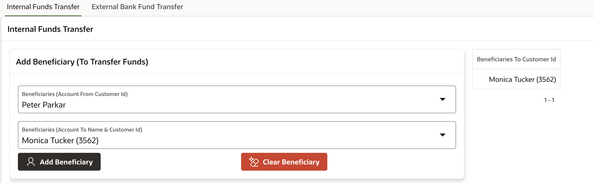
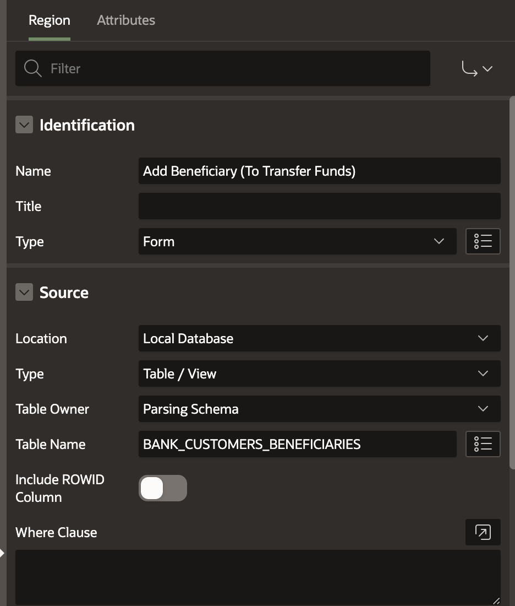
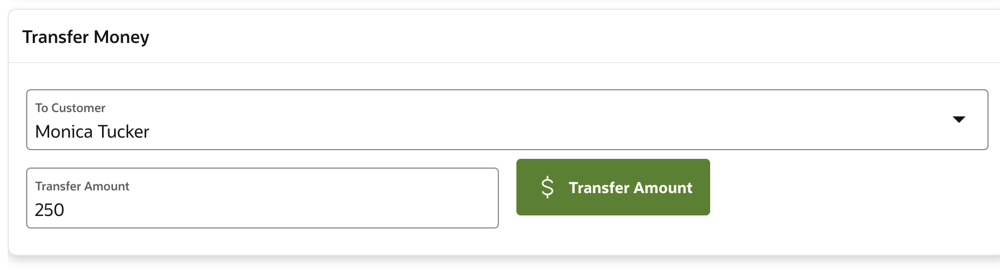
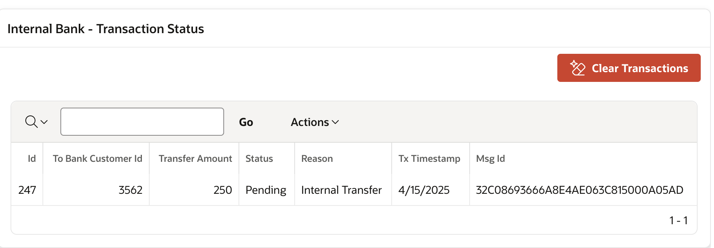
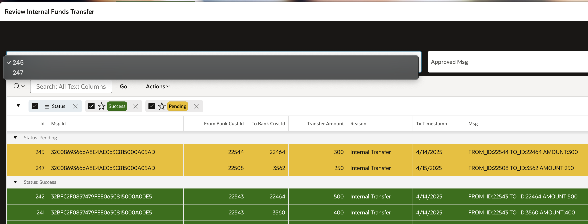

# Internal Fund Transfer: Transferring Funds Between Accounts in Same Bank

## About this workshop

Fund transfers can be categorized into two types: internal and external.

**Internal Funds Transfer:** This involves transferring funds between two accounts within the same bank. Internal transfers require review and approval by a banker prior to processing.

**External Funds Transfer:** This involves transferring funds from one bank account to another account in a different bank.

To manage fund transfer transactions efficiently, we employ a queuing system with two priority levels: high-priority for premium customers and normal priority for standard customers.

In the internal fund transfer use case, we will utilize enqueue and dequeue operations to facilitate transaction processing. This will be the focus of our current discussion.

We will explore external bank fund transfers in greater detail in our next lab.

Estimated Time: 60 minutes

---

### Objectives

The objective of this lab is to enable participants to:

*   Beneficiary Setup: 
    *   Add a beneficiary from available accounts. 
    *   Select a beneficiary from the list of existing beneficiaries. 
*   Queue Management: 
    *   Create a Enqueue to manage fund transfer transactions. 
*   Fund Transfer: 
    *   Enqueue a fund transfer message to initiate the transaction.
    *   Dequeue the fund transfer message to simulate banker approval and complete the transaction.
 
---

### Prerequisites

* A user with access to provision & manage core OCI services  
* Having completed common labs

--- 
 
### Introduction to this Lab

[Demo video on AI for Financial Services](youtube:Y5PziqsPcCI:large) 

---
 
## Task 1: Add Beneficiary

1. Select an account from the available options and add it as a beneficiary.
 
     

2. If you have not already created **BANK\_CUSTOMERS** table in previous labs then please use this script to create 

      ```sql 
        <copy>
        CREATE TABLE "BANK_CUSTOMERS" 
        (	
            "ID" NUMBER GENERATED BY DEFAULT ON NULL AS IDENTITY MINVALUE 1 MAXVALUE 999999999999 
            INCREMENT BY 1 START WITH 1 CACHE 20 NOORDER  NOCYCLE  NOKEEP  NOSCALE  NOT NULL ENABLE, 
            "GENDER" VARCHAR2(1), 
            "CUST_YEAR_OF_BIRTH" NUMBER, 
            "MARITAL_STATUS" VARCHAR2(50), 
            "STREET_ADDRESS" VARCHAR2(255), 
            "CUST_POSTAL_CODE" NUMBER, 
            "CITY" VARCHAR2(50), 
            "STATE_PROVINCE" VARCHAR2(50), 
            "COUNTRY_ID" VARCHAR2(50), 
            "PHONE_NUMBER" VARCHAR2(50), 
            "CUST_INCOME_LEVEL" VARCHAR2(500), 
            "CREDIT_LIMIT" NUMBER, 
            "CUST_VALID" VARCHAR2(1), 
            "CUSTOMER_NAME" VARCHAR2(100),  
            "DOB" DATE, 
            "CUSTOMER_ID" VARCHAR2(20), 
            "ACCOUNT_NUMBER" NUMBER, 
            "ACCOUNT_TYPE" VARCHAR2(20),  
            "COUNTRY" VARCHAR2(50),  
            "OCCUPATION_TYPE" VARCHAR2(50), 
            "INCOME_SOURCE" VARCHAR2(500), 
            "EDUCATIONAL_QUALIFICATION" VARCHAR2(100), 
            "CURRENT_BALANCE" NUMBER, 
            "ACCOUNT_STATUS" VARCHAR2(100), 
            "BANK_NAME" VARCHAR2(100),  
            "REQUEST_CARD" VARCHAR2(10), 
            "EMAIL" VARCHAR2(128), 
            PRIMARY KEY ("ID")
            USING INDEX  ENABLE
        ) ;
        </copy>
      ``` 
    
3. Create table **BANK\_CUSTOMERS\_BENEFICIARIES**

    ```sql 
        <copy>
          CREATE TABLE "BANK_CUSTOMERS_BENEFICIARIES" 
          (	
            "ID" NUMBER GENERATED BY DEFAULT ON NULL AS IDENTITY MINVALUE 1 MAXVALUE 9999999999 
            INCREMENT BY 1 START WITH 1 CACHE 20 NOORDER  NOCYCLE  NOKEEP  NOSCALE  NOT NULL ENABLE, 
            "BENEFICIARIES_NAME" VARCHAR2(128), 
            "BENEFICIARIES_TO_CUSTID" NUMBER, 
            "BENEFICIARIES_FROM_CUSTID" NUMBER, 
            CONSTRAINT "BANK_CUSTOMERS_BENEFICIARIES_ID_PK" PRIMARY KEY ("ID")
            USING INDEX  ENABLE
          ) ;

          ALTER TABLE "BANK_CUSTOMERS_BENEFICIARIES" ADD CONSTRAINT "BANK_CUSTOMERS_BENEFICIARIES_ID_FK" 
            FOREIGN KEY ("BENEFICIARIES_FROM_CUSTID")
            REFERENCES "BANK_CUSTOMERS" ("ID") ENABLE;

          CREATE INDEX "BANK_CUSTOMERS_BENEFICIARIES_I1" ON "BANK_CUSTOMERS_BENEFICIARIES" ("BENEFICIARIES_FROM_CUSTID") 
          ;
        end;
        </copy>
    ```
3. Create FORM in Oracle APEX as shown, this will add our new Beneficiary into **BANK\_CUSTOMERS\_BENEFICIARIES** table

  

## Task 2: Select Beneficiary
 
1.  Choose a beneficiary from the list of existing beneficiaries. Add beneficiaries from the selected list

    

2. Generate list of customers with their id internal to bank

    ```sql 
        <copy>
        select * from BANK_CUSTOMERS_BENEFICIARIES 
        WHERE BENEFICIARIES_FROM_CUSTID =  (select ID from bank_customers where upper(email) = upper(v('APP_USER')) AND rownum = 1);  
        </copy>
    ```

3. Click on **Transfer Amount** button, Create a dynamic action on button click as shown below

    ```sql 
        <copy>
        declare 
        v_new_id number;
        l_enqueue_options      DBMS_AQ.ENQUEUE_OPTIONS_T;
        l_message_properties   DBMS_AQ.MESSAGE_PROPERTIES_T;
        l_message_handle       RAW (16);
        l_queue_msg            banktransfer_q_payload; 
        message_id varchar2(200); 
        l_msg varchar2(400);  
        l_q_name varchar2(400) := 'DOCUSER.fundstransfer_queue'; 
        l_from_custid varchar2(50) := :P74_BENEFICIARIES_FROM_CUSTID;
        l_to_custid varchar2(50) := :P74_INT_TO_CUSTID;
        l_amount varchar2(50) := :P74_INT_AMOUNT;

        begin
            -- Generate Msg ----------------------
            l_msg   := 'FROM_ID:'||l_from_custid||' TO_ID:'||l_to_custid||' AMOUNT:'||l_amount;  


            ------------  Enque Message ---------- 
            l_queue_msg := banktransfer_q_payload (l_msg); 
            DBMS_AQ.ENQUEUE (queue_name           => l_q_name,
                          enqueue_options      => l_enqueue_options,
                          message_properties   => l_message_properties,
                          payload              => l_queue_msg,
                          msgid                => l_message_handle);

            SELECT MSG_ID INTO message_id
              FROM AQ$fundstransfer_queue_table
              WHERE ROWID = (SELECT MAX(ROWID)
                              FROM AQ$fundstransfer_queue_table); 
          

            ------------- Insert to DB --------------------------
            insert into FD_TRANSACTIONS_LOG 
            (
                  FROM_BANK_CUST_ID, TO_BANK_CUST_ID, TRANSFER_AMOUNT, 
                    STATUS, REASON,    TX_TIMESTAMP, MSG_ID, MSG
            ) 
            values 
            (
                  l_from_custid, l_to_custid, l_amount,
                  'Pending', 'Internal Transfer',   CURRENT_TIMESTAMP, message_id, l_msg
            ) RETURNING id INTO v_new_id ;
 
        COMMIT;
        EXCEPTION 
        WHEN OTHERS
        THEN DBMS_OUTPUT.put_line ( SQLERRM || ' - ' || DBMS_UTILITY.FORMAT_ERROR_BACKTRACE);
  
        end;
        </copy>
    ``` 

## Task 3: Create Queue
 
1.  Set up a queue to manage fund transfer transactions.
    
    

## Task 4: Initiate Fund Transfer (Enqueue)
 
1.  Enqueue a fund transfer message to initiate the transaction.
    
  

2. View Transfer Status

  

## Task 5: Approve Fund Transfer (Dequeue)
 
1.  Simulate banker approval by dequeuing the fund transfer message, thereby completing the transaction.
   
    
 
## Acknowledgements

* **Author** - Madhusudhan Rao B M, Principal Product Manager, Oracle Database
* **Last Updated By/Date** - April 16th, 2025

## Learn more
 
* [Oracle Digital Assistant Skills](https://docs.oracle.com/en/cloud/paas/digital-assistant/use-chatbot/create-configure-and-version-skills1.html)
