# Suspicious Transactions and Anomaly Detection

## About this workshop

Welcome to this workshop on anomaly detection in financial transactions! In this hands-on session, you'll learn how to build and test an anomaly detection model to identify suspicious transactions. You'll gain practical experience in creating a project, developing a model, testing its effectiveness, and visualizing anomalies on a map.

**Univariate Anomaly Detection**

Univariate Anomaly Detection (UAD) refers to the problem of identifying anomalies in a single time series data. A single time series data contains timestamped values for one signal (metric or measure)

**Multivariate Anomaly Detection**

Multivariate Anomaly Detection uses MSET2 (Multivariate State Estimation Technique) to learn the correlation between multiple signals over a large dataset of time series data.

**Asynchronous Detection**

Asynchronous Detection API can be used upon large to very large data sets to detect anomalies in both Univariate and Multivariate data sets.

Estimated Time: 60 minutes

---

### Objectives

By the end of this workshop, participants will be able to:

- Create an anomaly detection model to identify unusual transaction patterns.
- Set up an anomaly detection project and integrate the model.
- Test the model's effectiveness in detecting anomalies.
- Generate random transactions and evaluate the model's performance.
- Visualize anomalies on a map to identify potential hotspots.

These objectives clearly outline what participants can expect to learn and achieve by the end of the workshop, providing a clear direction for the training.

---

### Prerequisites

* A user with access to provision & manage core OCI services  
* Having completed common labs
- Anomaly detection service prerequisites
    - **Policy:** group <group_name> | group id <group_ocid> | dynamic-group <dynamic-group_name> | dynamic-group id <dynamic-group_ocid> | any-user

### Introduction to this Lab

[Demo video on AI for Financial Services](youtube:yZLq5UoFMtU:large)  

---
 
## Task 1: Anomaly Model Development

1. Create a statistical model to detect unusual patterns in financial transactions.
2. In this example, we will use Time-series data for Univariate Anomaly Detection. The generated data shows a time interval between two transactions with a valid amount. You can also download the [Sample Model Data](https://github.com/madhusudhanrao-ppm/code-assets/blob/main/AI-for-Financial-Services-Application/Chatbot/Anomaly_FD_Input_finserv_train_data_2.csv) used here or generate your own data. Alternatively, You can also use Multivariate Anomaly Detection data generated CSV files for regular non-anomalous transactions.

    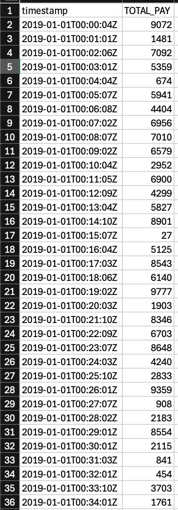

3. Upload the generated CSV file into the OCI Object Storage bucket and make a note of the folder and filename. We would need this while creating the model. 

    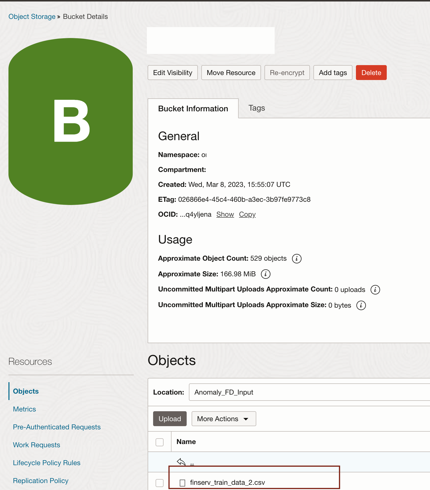
  
## Task 2: Project Setup

1. Select your working compartment in the OCI cloud console and Access the Anomaly detection AI service. 

    
 
2.  Configure an anomaly detection project and integrate the developed model.
 
    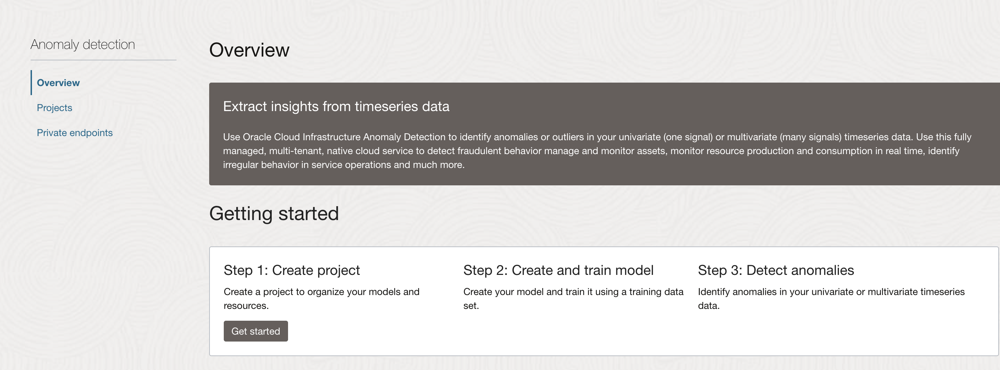 

3. Create Project, please select your working compartment
   
    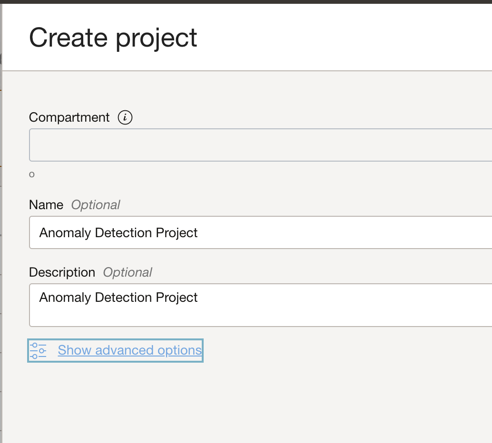

## Task 3: Create Dataset

1. Create Dataset, point this to your OCI Object storage Bucket location and the .CSV file uploaded
   
    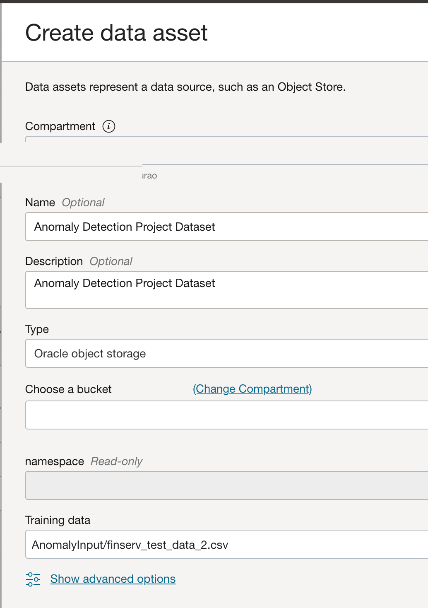

2. View confirmation information

    

## Task 4: Create Model

1. Create Model, Select the existing dataset
   
    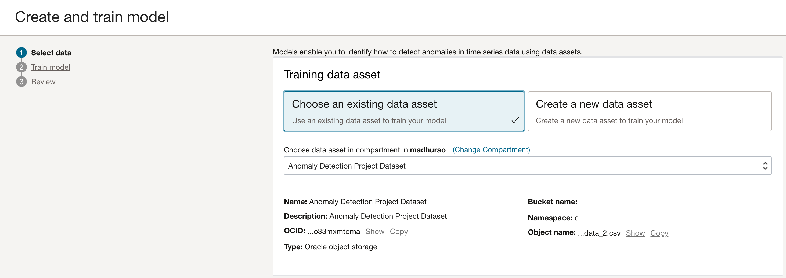

2. Choose Algorithm, in this case we are using **Univariate Anomaly Detection** 
   
    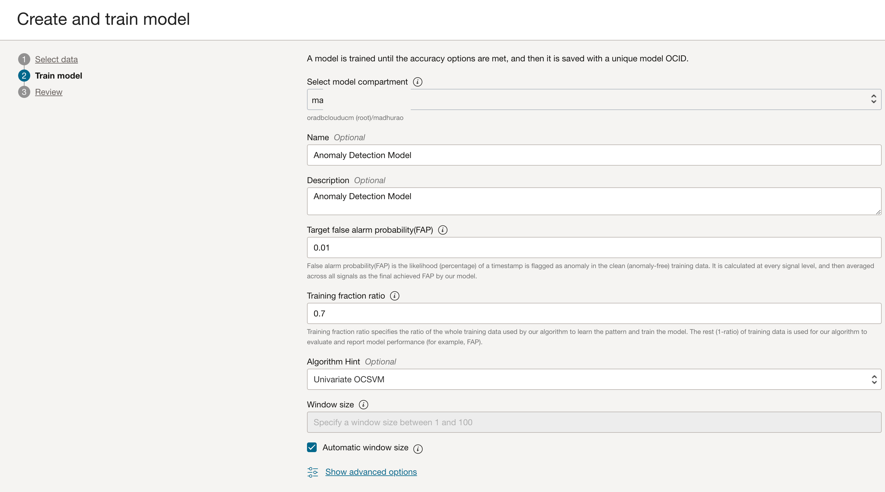

3. Review and Train Model
   
    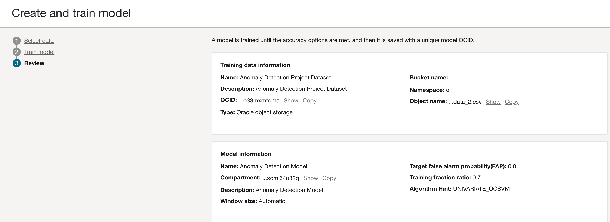

## Task 5: Model Validation - Simulation and Testing
 
1.  Test the anomaly detection model's effectiveness and accuracy.
2.  Click on **Detect Anomalies** button
   
   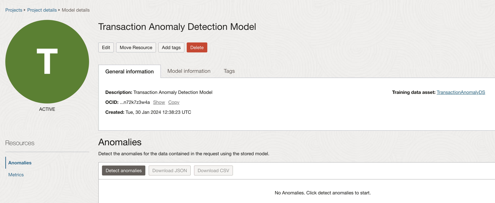

3.  Upload the Anomalous CSV file and see the detected anomalies. You can [Download this Sample CSV](https://github.com/madhusudhanrao-ppm/code-assets/blob/main/AI-for-Financial-Services-Application/Chatbot/Anomaly_FD_Input_finserv_test_model.csv) file for reference
    
4.  View Anomaly detection point 1 on the chart
 
    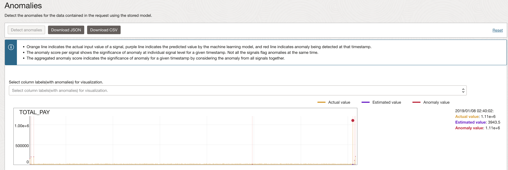

5.  View Anomaly detection on some other point
   
    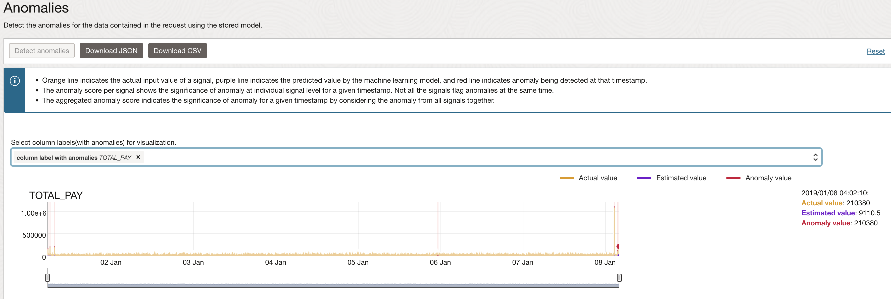
      
## Task 6: Database Design - Create Required tables for Anomaly Detection Visualization
  
1. Create **CC_FD** Table, This will hold credit card details related to customer (customer id)

    ```sql 
      <copy>
        CREATE TABLE "CC_FD" 
        (	
          "ID" NUMBER GENERATED BY DEFAULT ON NULL AS IDENTITY MINVALUE 1 MAXVALUE 9999999999 
              INCREMENT BY 1 START WITH 1 CACHE 20 NOORDER  NOCYCLE  NOKEEP  NOSCALE  NOT NULL ENABLE, 
          "CUST_ID" NUMBER, 
          "CC_NO" NUMBER, 
          "STATUS" VARCHAR2(50), 
          "VALIDITY" DATE, 
          "FIRST_NAME" VARCHAR2(50), 
          "LAST_NAME" VARCHAR2(50), 
          "BANK_NAME" VARCHAR2(50), 
          "COMMENTS" VARCHAR2(100), 
          "CARD_TYPE" VARCHAR2(10), 
          PRIMARY KEY ("ID") USING INDEX  ENABLE
        ) ;
      </copy>
    ```  

2. Please Note: UNESCO Heritage sites dataset is not provided in this lab, you can [search and download](https://www.google.com/search?q=UNESCO+Heritage+sites+dataset) it from internet or generate your own. the DDL provided here for your reference.

    ```sql 
      <copy>
        CREATE TABLE "UNESCO_SITES" 
        ( 
          "ID" NUMBER GENERATED BY DEFAULT ON NULL AS IDENTITY MINVALUE 1 MAXVALUE 9999999999 
          INCREMENT BY 1 START WITH 1 CACHE 20 NOORDER  NOCYCLE  NOKEEP  NOSCALE  NOT NULL ENABLE, 
          "CATEGORY" VARCHAR2(50), 
          "STATES_NAME_EN" VARCHAR2(255), 
          "REGION_EN" VARCHAR2(255),  
          "NAME_EN" VARCHAR2(255), 
          "SHORT_DESCRIPTION_EN" VARCHAR2(32767),  
          "LONGITUDE" NUMBER, 
          "LATITUDE" NUMBER, 
          "CATEGORY_SHORT" VARCHAR2(1), 
          "GEOMETRY" VARCHAR2(32767), 
          "TOP_10" VARCHAR2(50),  
          PRIMARY KEY ("ID")
          USING INDEX  ENABLE
        ) ; 
      </copy>
    ```  

3. Create Table **FD\_TX\_HISTORIC\_DATA**

    ```sql 
    <copy> 
    CREATE TABLE "FD_TX_HISTORIC_DATA" 
    (	
        "ID" NUMBER GENERATED BY DEFAULT ON NULL AS IDENTITY MINVALUE 1 MAXVALUE 9999999999 
        INCREMENT BY 1 START WITH 1 CACHE 20 NOORDER  NOCYCLE  NOKEEP  NOSCALE  NOT NULL ENABLE, 
        "TX_TIMESTAMP" TIMESTAMP (9) WITH TIME ZONE, 
        "TOTAL_PAY" NUMBER, 
        "IS_ANOMALY" VARCHAR2(50), 
        "INV_NO" VARCHAR2(50), 
        "CATEGORY" VARCHAR2(50), 
        "CUST_ID" NUMBER, 
        "CREDIT_CARD_NO" NUMBER, 
        "TRANS_STATUS" VARCHAR2(20), 
        "TRANSACTION_STATUS" VARCHAR2(50), 
        "MERCHANT_ID" NUMBER, 
        "MERCHANT_CITY" VARCHAR2(100), 
        "MERCHANT_REGION" VARCHAR2(255), 
        "MERCHANT_STATE" VARCHAR2(100), 
        "MERCHANT_PLACE" VARCHAR2(100), 
        "LONGITUDE" NUMBER, 
        "LATITUDE" NUMBER, 
        "MERCHANT_PLACE_ID" NUMBER, 
        "CUSTOMER_FULLNAME" VARCHAR2(100), 
        "MERCHANT_FULLNAME" VARCHAR2(100), 
        "MALL" VARCHAR2(50), 
        PRIMARY KEY ("ID")
        USING INDEX  ENABLE
    ) ;  
    </copy>
    ``` 
   
4. PL/SQL Procedure Create Random Transactions and to Invoke REST API to detect Anomalies are shown below

    ```sql 
    <copy> 
    create or replace PROCEDURE FD_TX_ANM_INSERTS  
    AS 
    ---------- Transaction variables ----------------
    v_total_pay FD_TX_HISTORIC_DATA.TOTAL_PAY%TYPE;
    v_time_diff number := 1; 
    -- Oracle APEX Web Credentials
    GC_WC_CREDENTIAL_ID        CONSTANT VARCHAR2(50)   := 'replace-this'; 
    l_response_json CLOB;
    json_input_str3 varchar2(32000) ;
    l_api_url varchar2(1000) := 'https://anomalydetection.aiservice.us-phoenix-1.oci.oraclecloud.com/20210101/actions/detectAnomalies';
    l_body varchar2(32000) ; 
    v_INV_NO FD_TX_HISTORIC_DATA.INV_NO%TYPE;
    v_TX_TIMESTAMP FD_TX_HISTORIC_DATA.TX_TIMESTAMP%TYPE; 
    v_CATEGORY FD_TX_HISTORIC_DATA.CATEGORY%TYPE; 
    v_CUST_ID FD_TX_HISTORIC_DATA.CUST_ID%TYPE;
    v_MERCHANT_ID FD_TX_HISTORIC_DATA.MERCHANT_ID%TYPE;
    v_CUSTOMER_FULLNAME FD_TX_HISTORIC_DATA.CUSTOMER_FULLNAME%TYPE; 
    v_MERCHANT_FULLNAME FD_TX_HISTORIC_DATA.MERCHANT_FULLNAME%TYPE;  
    v_MERCHANT_PLACE_ID   FD_TX_HISTORIC_DATA.MERCHANT_PLACE_ID%TYPE; 
    v_MERCHANT_PLACE   FD_TX_HISTORIC_DATA.MERCHANT_PLACE%TYPE; 
    v_LONGITUDE   FD_TX_HISTORIC_DATA.LONGITUDE%TYPE;
    v_LATITUDE   FD_TX_HISTORIC_DATA.LATITUDE%TYPE; 
    v_MERCHANT_REGION   FD_TX_HISTORIC_DATA.MERCHANT_REGION%TYPE;
    v_MERCHANT_CITY FD_TX_HISTORIC_DATA.MERCHANT_CITY%TYPE;
    v_MERCHANT_STATE   FD_TX_HISTORIC_DATA.MERCHANT_STATE%TYPE;  
    v_MALL  FD_TX_HISTORIC_DATA.MALL%TYPE;
    v_CREDIT_CARD_NO   FD_TX_HISTORIC_DATA.CREDIT_CARD_NO%TYPE;  
    v_rand_no number;
    ---------- Transaction variables ----------------
    
    ---------- JSON returning from Anomaly Detection AI Service ------------
    CURSOR tx_anm_crs (l_response_json IN CLOB) IS 
        SELECT jt.* 
        FROM   JSON_TABLE(l_response_json, '$.detectionResults[*]' 
                COLUMNS (tx_timestamp      VARCHAR2(100)  PATH '$.timestamp' , actualValue VARCHAR2(100)  PATH '$.anomalies.actualValue' )) jt; 

    ---------- Cursor to get Generated Random Transactions -----------------
    cursor c1 is 
        SELECT  JSON_ARRAYAGG(
                    JSON_OBJECT
                    (
                            'timestamp' VALUE TO_CHAR((  TX_TIMESTAMP  ), 'YYYY-MM-DD"T"HH24:MI:SS".000Z"' ), 
                            'values' VALUE json_array(TOTAL_PAY)   
                    ) ORDER BY TX_TIMESTAMP   )  as TX_DATA  
    FROM FD_TX_HISTORIC_DATA  ;
     
    BEGIN 

    ---- BEGIN GENERATING RANDOMS ------------------------------- 

    ------ clean up current data as we are generating new data here ---------------------------------- 
    DELETE from FD_TX_HISTORIC_DATA;
    ------ lets make all credit cards active we dont want to start with blocked cards -----------------
    UPDATE CC_FD SET STATUS = 'Active'; 

    FOR Lcntr IN 1..20 LOOP
            -- Any transaction less than 12,000 may be treated as valid
            v_total_pay := round(DBMS_Random.Value(1,12000),0);  
            v_INV_NO := 'INV-RAND_'||v_total_pay; 
            v_CUST_ID := round(DBMS_Random.Value(1,40),0);

            select distinct FIRST_NAME||' '||LAST_NAME into v_CUSTOMER_FULLNAME from FINBANK_ACCOUNTS 
            where id = v_CUST_ID;

            SELECT category into v_CATEGORY FROM ( select distinct category  from RETAIL_SHOPPING 
            WHERE CATEGORY != '-' ORDER BY DBMS_RANDOM.RANDOM) WHERE  rownum < 2; 

            v_MERCHANT_ID := round(DBMS_Random.Value(1,40),0);

            SELECT distinct FIRST_NAME||' '||LAST_NAME into v_MERCHANT_FULLNAME from FINBANK_ACCOUNTS 
            where id = v_MERCHANT_ID;  

            SELECT  ID, NAME_EN, LONGITUDE, LATITUDE, REGION_EN, STATES_NAME_EN into 
                    v_MERCHANT_PLACE_ID,  v_MERCHANT_PLACE, v_LONGITUDE, v_LATITUDE , 
                    v_MERCHANT_REGION, v_MERCHANT_STATE
                    from 
                    (select ID, NAME_EN, LONGITUDE, LATITUDE, REGION_EN, STATES_NAME_EN  from UNESCO_SITES 
                    where REGION_EN = 'Europe and North America' AND STATES_NAME_EN = 'United States of America' ORDER BY DBMS_RANDOM.RANDOM) 
                    WHERE  rownum < 2; 

            SELECT  mall into v_MALL from 
                    (select distinct mall from RETAIL_SHOPPING where mall is not null ORDER BY DBMS_RANDOM.RANDOM) 
            WHERE  rownum < 2;

            SELECT  CC_NO into v_CREDIT_CARD_NO from 
                    (select CC_NO from CC_FD where STATUS = 'Active' ORDER BY DBMS_RANDOM.RANDOM) 
            WHERE  rownum < 2; 

            v_TX_TIMESTAMP := current_timestamp + numToDSInterval( v_time_diff, 'second' ); 

            INSERT INTO FD_TX_HISTORIC_DATA 
            (
                    INV_NO,  CATEGORY,  TX_TIMESTAMP, TOTAL_PAY,  
                    MALL,  CUST_ID,  CREDIT_CARD_NO, MERCHANT_ID, 
                    MERCHANT_REGION,  MERCHANT_CITY, MERCHANT_STATE, 
                    MERCHANT_PLACE,  LONGITUDE,  LATITUDE, 
                    MERCHANT_PLACE_ID,  CUSTOMER_FULLNAME,  MERCHANT_FULLNAME
            ) 
            values
            (
                    v_INV_NO,  v_CATEGORY,  v_TX_TIMESTAMP,  v_total_pay,  
                    v_MALL, v_CUST_ID, v_CREDIT_CARD_NO, v_MERCHANT_ID, 
                    v_MERCHANT_REGION, v_MERCHANT_CITY, v_MERCHANT_STATE,  
                    v_MERCHANT_PLACE,  v_LONGITUDE,  v_LATITUDE, 
                    v_MERCHANT_PLACE_ID,  v_CUSTOMER_FULLNAME, v_MERCHANT_FULLNAME
            );
            v_time_diff := v_time_diff + 1;

    END LOOP;

    -- Lets ensure that we also generate few anomalies 
    FOR Lcntr2 IN 1..5 LOOP
            -- Any transaction more than 12,000 and less than 55000 may be treated as anomalies
            v_total_pay := round(DBMS_Random.Value(1,55000),0);  
            v_INV_NO := 'INV-RAND_'||v_total_pay; 
            v_CUST_ID := round(DBMS_Random.Value(1,40),0);
            select distinct FIRST_NAME||' '||LAST_NAME into v_CUSTOMER_FULLNAME from FINBANK_ACCOUNTS 
            where id = v_CUST_ID;

            SELECT category into v_CATEGORY FROM ( select distinct category  from RETAIL_SHOPPING  ORDER BY DBMS_RANDOM.RANDOM) 
            WHERE  rownum < 2; 
            v_MERCHANT_ID := round(DBMS_Random.Value(1,40),0);
            select distinct FIRST_NAME||' '||LAST_NAME into v_MERCHANT_FULLNAME from FINBANK_ACCOUNTS 
            where id = v_MERCHANT_ID;   

            select  ID, NAME_EN, LONGITUDE, LATITUDE, REGION_EN, STATES_NAME_EN into v_MERCHANT_PLACE_ID,  v_MERCHANT_PLACE, v_LONGITUDE, v_LATITUDE , v_MERCHANT_REGION, v_MERCHANT_STATE
                    from (select ID, NAME_EN, LONGITUDE, LATITUDE, REGION_EN, STATES_NAME_EN  from UNESCO_SITES  ORDER BY DBMS_RANDOM.RANDOM) 
                    WHERE  rownum < 2;  
            select  mall into v_MALL from (select distinct mall from RETAIL_SHOPPING where mall is not null ORDER BY DBMS_RANDOM.RANDOM) 
            WHERE  rownum < 2;

            select  CC_NO into v_CREDIT_CARD_NO from (select CC_NO from CC_FD where STATUS = 'Active' ORDER BY DBMS_RANDOM.RANDOM) 
            WHERE  rownum < 2; 
            v_TX_TIMESTAMP := current_timestamp + numToDSInterval( v_time_diff, 'second' ); 
            INSERT INTO FD_TX_HISTORIC_DATA 
            (
                    INV_NO,  CATEGORY,  TX_TIMESTAMP, TOTAL_PAY,  
                    MALL,  CUST_ID,  CREDIT_CARD_NO, MERCHANT_ID, 
                    MERCHANT_REGION,  MERCHANT_CITY, MERCHANT_STATE, 
                    MERCHANT_PLACE,  LONGITUDE,  LATITUDE, 
                    MERCHANT_PLACE_ID,  CUSTOMER_FULLNAME,  MERCHANT_FULLNAME
            ) 
            values
            (
                    v_INV_NO,  v_CATEGORY,  v_TX_TIMESTAMP,  v_total_pay,  
                    v_MALL, v_CUST_ID, v_CREDIT_CARD_NO, v_MERCHANT_ID, 
                    v_MERCHANT_REGION, v_MERCHANT_CITY, v_MERCHANT_STATE,  
                    v_MERCHANT_PLACE,  v_LONGITUDE,  v_LATITUDE, 
                    v_MERCHANT_PLACE_ID,  v_CUSTOMER_FULLNAME, v_MERCHANT_FULLNAME
            );
            v_time_diff := v_time_diff + 1;
    END LOOP;
 
    For row_1 In C1 Loop
    json_input_str3 := row_1.TX_DATA; 
    End Loop;
    -- lets call anomaly detection AI model with the corresponding Model ID 
    -- OCID copied from the Model that we created
    l_body   := '{
            "modelId": "ocid1.aianomalydetectionmodel.oc1.phx.your-model-id",
            "requestType": "INLINE",
            "signalNames":["TOTAL_PAY"],
            "data":   '||json_input_str3||'
    }'; 
    apex_web_service.g_request_headers.DELETE; 
    apex_web_service.g_request_headers(1).name  := 'Content-Type'; 
    apex_web_service.g_request_headers(1).value := 'application/json'; 

    -- Call the Document AI analyzeDocument REST Web Service.  
    l_response_json := apex_web_service.make_rest_request 
    (p_url                  => l_api_url, 
    p_http_method          => 'POST', 
    p_body                 => l_body, 
    p_credential_static_id => GC_WC_CREDENTIAL_ID); 

    For row_1 In tx_anm_crs (l_response_json) Loop 
    -------- run update query based on Anomalies detected from returing JSON from AI Service -----------
    UPDATE FD_TX_HISTORIC_DATA SET IS_ANOMALY = 'YES' WHERE TOTAL_PAY = row_1.actualValue;
    End Loop; 

    END;
    /
    </copy>
    ``` 

## Task 7: Anomaly Visualization
 
1.  Create Oracle APEX data grid and analyze detected anomalies. 

    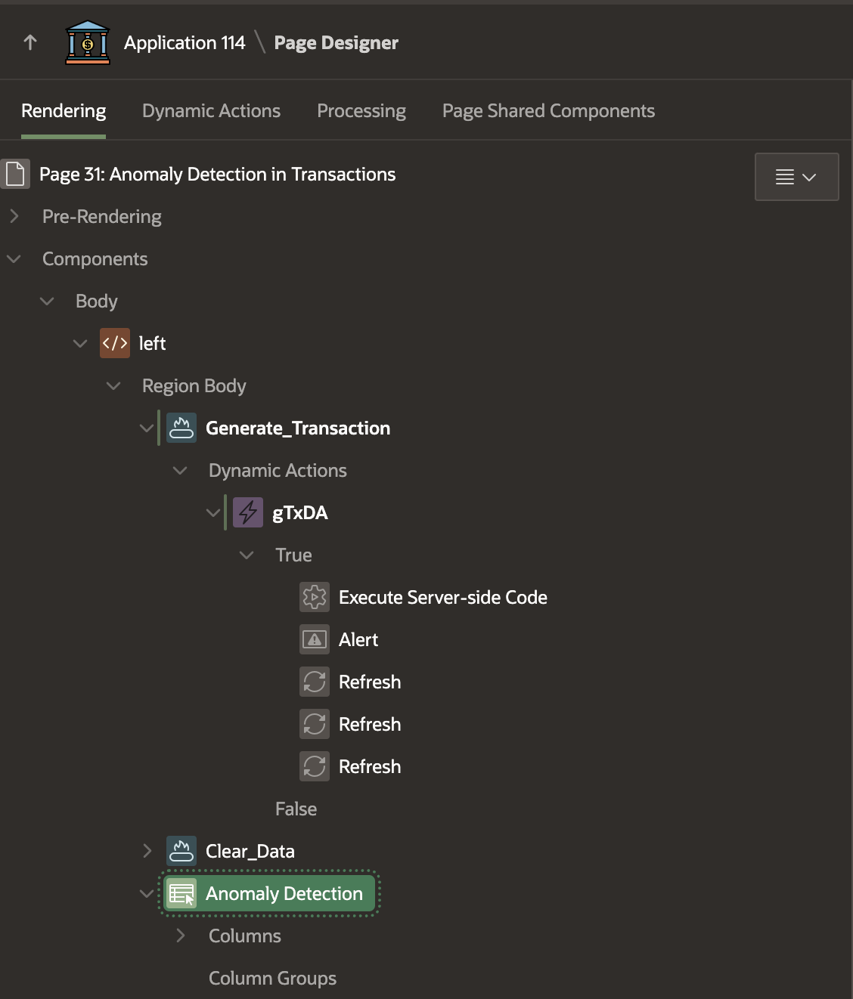 

2. In the Dynamic Actions, we will call the PL/SQL function to Generate and Get Anomalies in Transactions

    ```sql 
    <copy> 
    declare   
    begin 
        FD_TX_ANM_INSERTS (); 
    end;
    </copy>
    ``` 

3. Finally, Create Interactive report with following SQL to build the data table

    ```sql 
    <copy> 
    select ID,
       to_char(TX_TIMESTAMP,'dd/mm/yyyy hh24:mi:ss') TX_TIMESTAMP,
       '$ '||TOTAL_PAY as TOTAL_PAY,
       IS_ANOMALY, INV_NO, CATEGORY,
       CUST_ID, CREDIT_CARD_NO,  MERCHANT_ID,
       MERCHANT_CITY, MERCHANT_REGION, MERCHANT_STATE,
       MERCHANT_PLACE,  MERCHANT_PLACE_ID, CUSTOMER_FULLNAME,
       MERCHANT_FULLNAME, MALL
    from FD_TX_HISTORIC_DATA   order by IS_ANOMALY
    </copy>
    ``` 

4. Anomalous Transactions are shown in red
   
       

    > **Congratulations**, you have completed **Suspicious Transactions and Anomaly Detection** Lab. The subsequent labs are optional, however, please proceed to the next lab to learn more about **Customer Analysis**. 
 
## Lab Resources
 
* [Sample Model Training Data](https://github.com/madhusudhanrao-ppm/code-assets/blob/main/AI-for-Financial-Services-Application/Chatbot/Anomaly_FD_Input_finserv_train_data_2.csv)
* [Sample Model Testing Data](https://github.com/madhusudhanrao-ppm/code-assets/blob/main/AI-for-Financial-Services-Application/Chatbot/Anomaly_FD_Input_finserv_test_model.csv) 

## Acknowledgements

* **Author** - Madhusudhan Rao B M, Principal Product Manager, Oracle Database
* **Last Updated By/Date** - April 22nd, 2025

## Learn more
  
* [Anomaly Detection Policies](https://docs.oracle.com/en-us/iaas/Content/anomaly/using/policies.htm#policies)
