# Building a Conversational Interface with Oracle Digital Assistant and Oracle APEX: A Step-by-Step Guide

## About this workshop

This article provides a comprehensive walkthrough of creating a chatbot using Oracle Digital Assistant (ODA) and integrating it with Oracle APEX. Through 15 hands-on tasks, readers will learn how to:

- Provision Oracle Digital Assistant from OCI services and create a new skill
- Develop a knowledge document for FAQs and train the model
- Preview and refine the model and skill
- Enhance the chatbot with auto-complete suggestions and utterances
- Create a web channel for the skill and configure settings
- Integrate the Oracle Digital Assistant chatbot with Oracle APEX using the native client SDK
- Upload necessary files and add HTML code to deploy the chatbot on an APEX page

By following these steps, readers will be able to create a functional chatbot that provides an engaging conversational interface for users, and deploy it on an Oracle APEX page. The final demo will showcase the chatbot's capabilities and provide a seamless user experience.

---

**Oracle Digital Assistant**

Oracle Digital Assistant delivers a complete AI platform to create conversational experiences for business applications through text, chat, and voice interfaces.
  
*Conversational AI*

Natural language understanding and machine learning
Oracle Digital Assistant applies deep semantic parsing using natural language processing, natural language understanding (NLU), and custom algorithms to understand common conversations to derive accurate intent and context.
 
*AI-powered voice*

Eliminate reliance on third-party offerings with Oracle’s AI-powered voice. Users can communicate with their business application using voice commands with an assistant that understands their business-specific vocabulary and enables naturally expressive interactions. Give your customers more control of their data by providing end-to-end security and compliance with privacy standards, such as PII and GDPR.

*Analytics and insights*

Gain customer insights through built-in analytics that identify conversational bottlenecks and usage patterns and make data-driven decisions that continually improve the user experience.

Estimated Time: 60 minutes

---

### Objectives

To set up the Oracle Digital Assistant on the OCI tenancy, you will:

- Log into OCI
- Provision Oracle Digital Assistant from OCI services
- Create Oracle Digital Assistant skill
- Add knowledge document for frequently asked questions (FAQs)
- Train the Model
- Preview the Model and Skill
- Add Auto complete suggestion and utterances.
- Create Web Channel for a Skill
- Download Oracle Digital Assistant - Oracle Native Client SDK
- Get channel id from ODA console.
- Configure settings.js file
- Upload CSS, Image and JS files to Oracle APEX
- HTML Code to add ODA chatbot on APEX page.
- Bot initiated conversation (Optional Task).
- Demo of chatbot in Oracle APEX Page

---

### Prerequisites

* A user with access to provision & manage Core OCI services like Oracle Digital Assistant
* Having completed common labs

---
 
## Task 1: Log into OCI

1. Login into OCI

    To setup environment, you need OCI administrator's privileges. If you've got these privileges, login into OCI at [cloud.oracle.com](https://www.oracle.com/cloud/sign-in.html). the below image indicates SSO Login as an administrative user. If you have administrative privileges and complete access over a tenancy then you need not create any of the policies below steps.

    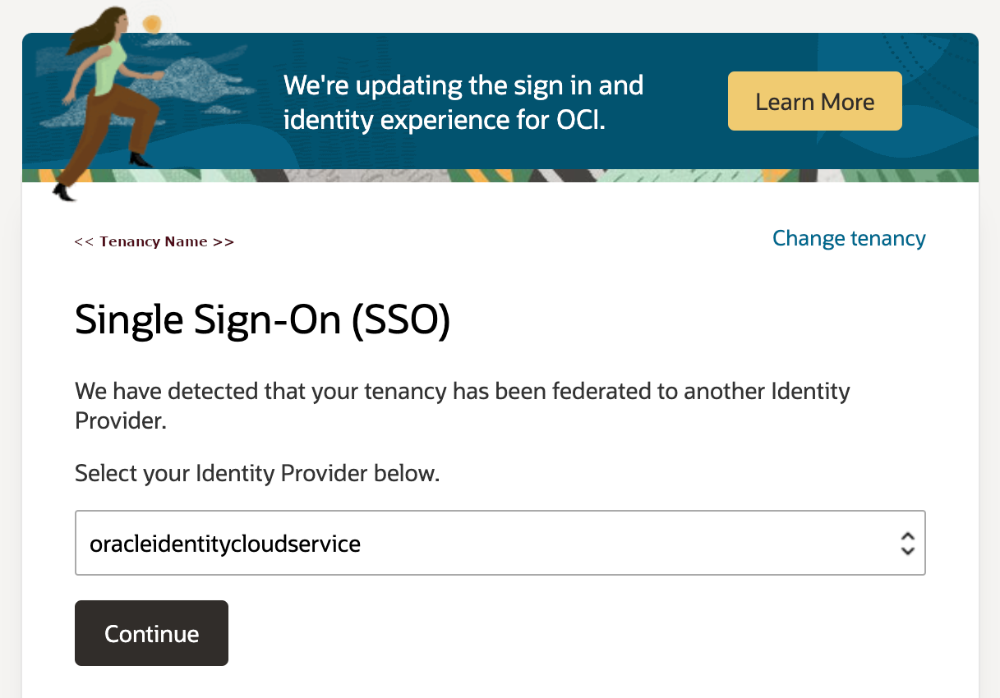

2. If you do not have administrative privileges into tenancy, you might have to login as federated user, that is the user created by the administrator

    

    In case you haven't got OCI administrator's privileges, you should ask your OCI administrator to perform the rest of the tasks in this lab.

---

## Task 2: Provision Oracle Digital Assistant from OCI services
 
1.  On the Oracle Cloud Infrastructure Console Home page, click the Navigation Menu in the upper-left corner, select **Analytics & AI**, and then select **Digital Assistant**.

  

2.  On the OCI Digital Assistants page,  click on the **Create digital assistant instance** button

    


3.	Select the  compartment where you want to create the digital assistant, provide a name,  description for the digital assistant and select development as the shape and click **Create** button.
  
1.  The Oracle Digital Assistant is being provisioned and below screen shows the current status and the final status of the provision.
 
     The Oracle Digital Assistant is provisioned, click on **Service console** button.
  

  In the sign-in box, provide the **Tenancy**  name and click on **Continue**

   and Login as Options in Task 1 

## Task 3:  Create Oracle Digital Assistant skill

1. After Logging into ODA, click on left navigation, select Development, 

  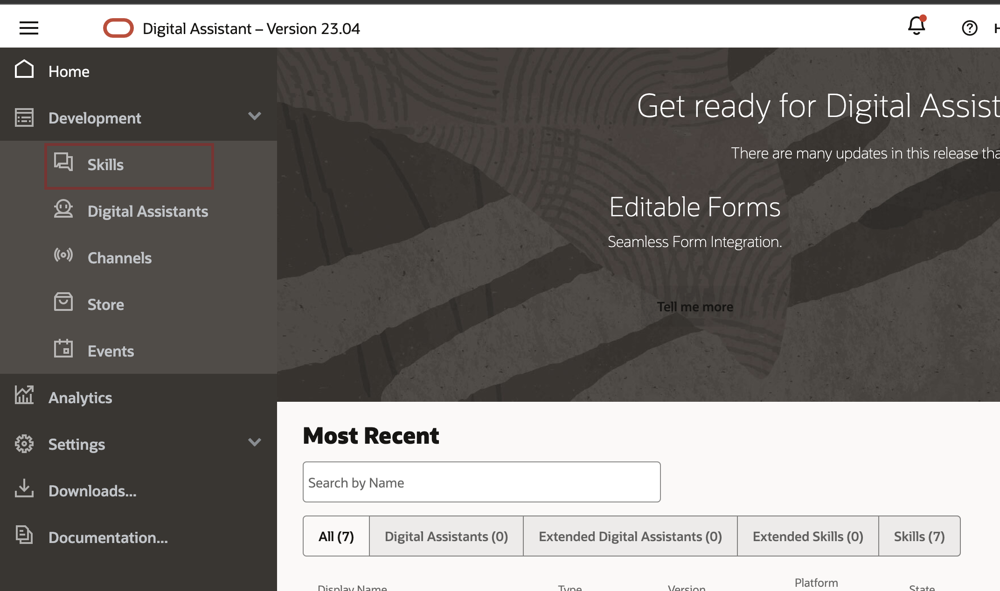

2. Click on **Skills**, click on create **New Skill**

  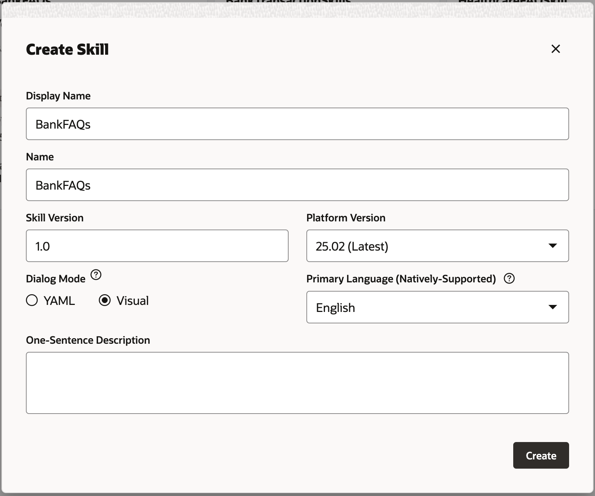

1. Type in display name, select **Visual** as Dialog mode.

  Click on **Create** button.

## Task 4: Add knowledge document for frequently asked questions (FAQs)

1. Click on Add knowledge document icon. 

  

2. Provide the URL for FAQs or upload a PDF file with Questions and Answers or a HTML page.
 
  This will start creation of [ODA Intents](https://docs.oracle.com/en/cloud/paas/digital-assistant/use-chatbot/intents1.html) automatically from FAQ URL.
 
3. View the progress.
 
4. Review the intents.

  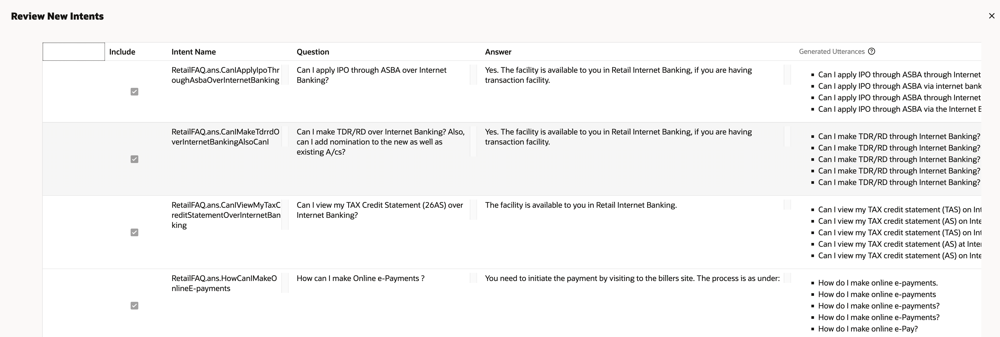

  Review new intents and edit if required, click on  **Add Intents to Skill** button
 
5. Click on **Yes** button.
 
## Task 5:  Train the Model
 
1. Click on **Train** button, 

  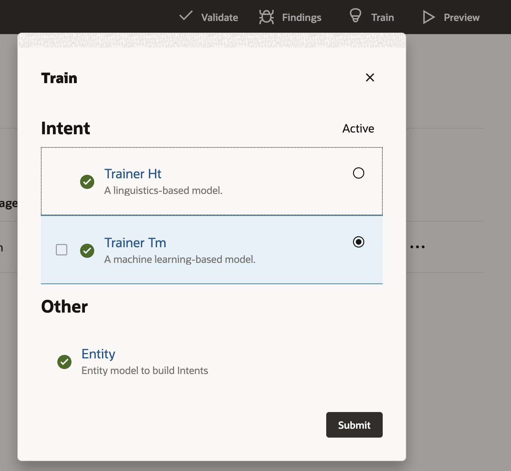

2. Select **Linguistic based Model**, click **Submit** button
 
3. Select **Machine learning based Model**, click **Submit** button
 
## Task 6:  Preview the Model and Skill

1. Click on **Preview** icon in the top navigation next to **Train** button, This will open intent test area where you can provide input and review the output that should identify the intent and deliver the answer.On the right side under Intent/Q&A review the flow especially the one with 100% scoring.
 
  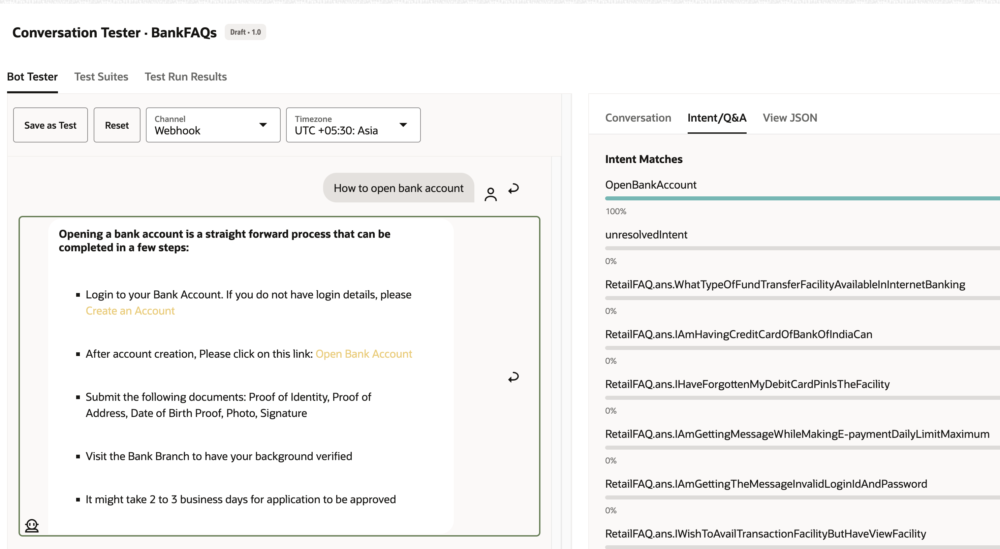 
 
## Task 7:  Add Auto complete suggestion and utterances.

1. Under the Intent, you can also add **Auto Complete Suggestion**. where user need not type the entire question to get his question intent and get the corresponding answer.

  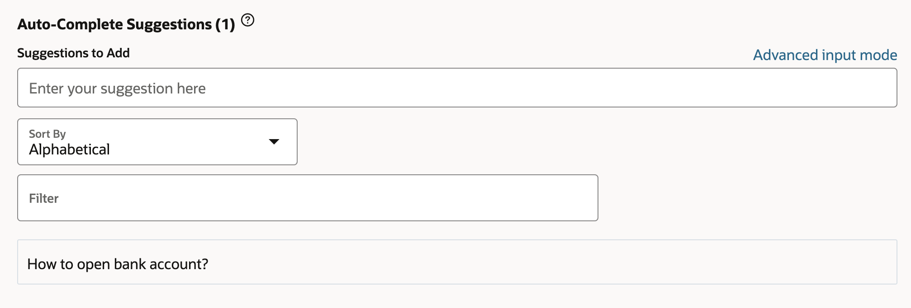

2. Under the Intent, review **Utterances**, same question can be asked in different ways, this is where we capture different questions that link to same answer or have a common intent.

  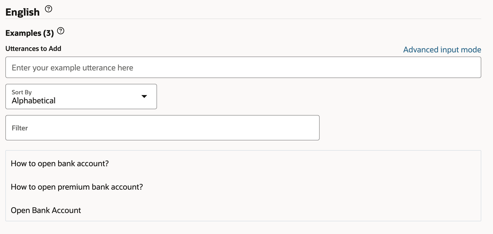

## Task 8: Create Web Channel for a Skill

1. Click on the left navigation menu, Under **Development** select **Channels**, Click on **Add Channel** button

  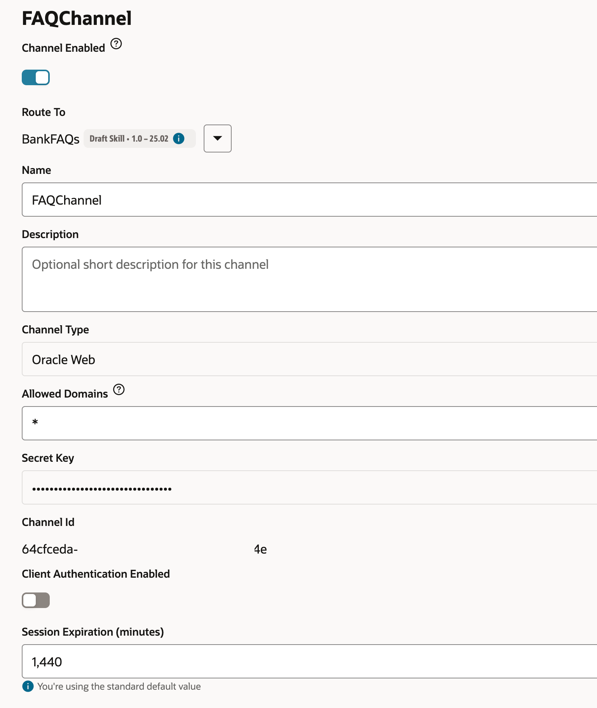

2. Provide **channel name**, select the skill which we just created under **Route To** option, 
 
3. Channel type should be **Oracle Web**, Allowed domains can be * or you can specify any particular domain which will act as host to this channel. This will generate **secret** and **channel id** 
  
## Task 9: Download Oracle Digital Assistant - Oracle Native Client SDK
 
1. From Oracle Digital Assistant and Oracle Mobile Cloud Downloads [Downloads](https://www.oracle.com/downloads/cloud/amce-downloads.html) Under **Web SDK** download latest client **ODA Web SDK 25.02 - Latest**

    Extract **Oracle Digital Assistant** zip file, please note version numbers might change

    

2. Run the index.html file from your web browser, This will show the disconnected status

    

## Task 10: Get channel id from ODA console. 

1. Login to Oracle Digital Assistant and under Channels, copy the channel id
 

## Task 11: Configure settings.js file

1. Edit **settings.js** file under samples/web/scripts folder. Folder structure samples/web/index.html

    

    In **chatWidgetSettings** update **URI** and **channelId**
 
    ```javascript
    <copy>
    const chatWidgetSettings = {
            URI: 'https://oda-your-instance-.data.digitalassistant.oci.oraclecloud.com/',         
            clientAuthEnabled: isClientAuthEnabled,     
            channelId: '4f877adf-your-channelid',    
            userId: '<userID>',                          
            enableAutocomplete: true,               
            enableBotAudioResponse: true,             
            enableClearMessage: true,                 
            enableSpeech: true,                   
            showConnectionStatus: true,        
        };
    </copy>
    ```

    

2. Now the chatbot is connected with channel.
 
3. You can see Auto complete questions and get corresponding answers.

    

## Task 12: Upload CSS, Image and JS files to Oracle APEX 

1. Upload CSS, Image and JS files to Oracle APEX under \Shared Components\Static Application Files

    

    

2. CSS file can be customized for placement of chat icon and colors. 

    ```css 
        <copy>
        /* chatbot style  */  
        .oda-chat-wrapper {
            --color-branding: #0572ce !important;
        }
        .oda-chat-wrapper.oda-chat-redwood-dark.oda-chat- {
            --color-branding: #0572ce!important;
        } 
        .oda-chat-wrapper .oda-chat-widget  { 
            bottom: calc(var(--position-bottom) * -1)!important; 
            border-radius: 6px 6px 0 0!important;
            box-shadow: 0px -4px 32pxrgba(0,0,0,.1);
            right: calc(var(--position-right) * -1)!important; 
        }  
        .oda-chat-wrapper.oda-chat-redwood-dark {
            color-branding: red;
            color-launch-icon-background: maroon;
        } 
        .oda-chat-wrapper .oda-chat-button { 
        background-color: #514C47;
        border-radius: 0;
        overflow: visible;
        } 
        .oda-chat-wrapper {
            color-branding: #3f41c0;
            color-launch-icon-background: #3f41c0;
        } 
        /* readmore style */
        .readMore {
            color: #fff !important;
            background-color: red;
            font-size: 12pt;
            padding: 4px;
            outline: 0;
            -moz-outline: 0;
            border: 0;
        } 
        .readMore:hover {
            color: #fff !important;
            background-color: #606060 !important;
        }
        .more {
        display: none;
        } 
    </copy>
    ```

## Task 13: HTML Code to add ODA chatbot on APEX page. 

1. Add **Static Content** under APEX Body region

    

    ```html 
        <copy>
        <head>
        <script src="#APP_FILES#oda/settings#MIN#.js"></script>
        <script src="#APP_FILES#oda/web-sdk.js" onload="initSdk('Bots')"></script>
        <link rel="stylesheet" href="#APP_FILES#oda/redwood-base-style#MIN#.css" >  
        </head>
        </copy>
    ```

## Task 14: Bot initiated conversation and Custom Intents (Optional Task).

1. Instead of user initiating conversation, you can have bot initiate the conversation, to do this update settings.js with following 

    

    ```javascript 
        <copy>
            initUserHiddenMessage: "Hi", 
            i18n: {                                     
                // Provide translations for the strings used in the widget
                en: {                                   
                    // en locale, can be configured for any locale
                    chatTitle: 'Ask Sam'       
                    // Set title at chat header
                }
            }, 
        </copy>
    ```
 
2. Let us now add two custom intents one for **Opening a Bank Account** as shown below

    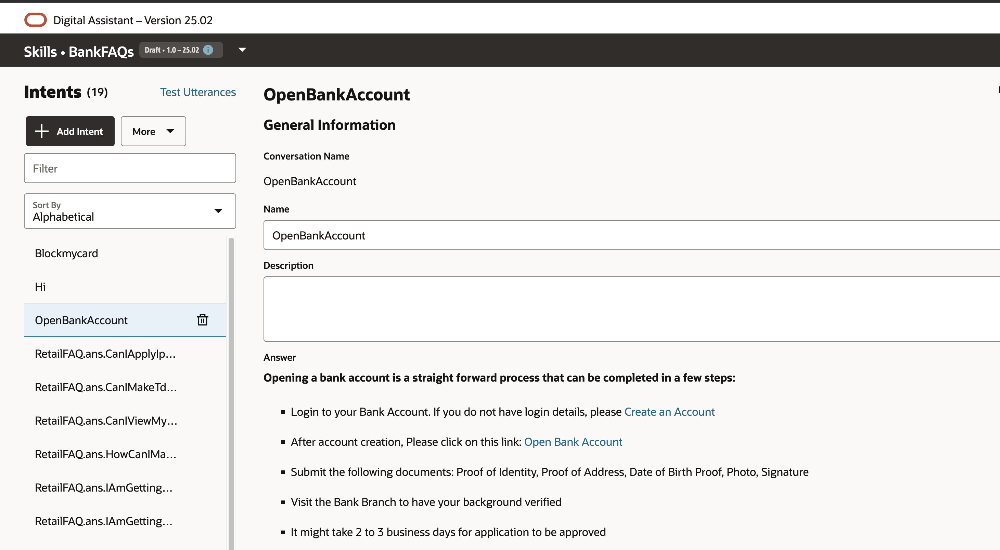

3. Another intent for **Support Request**. as shown below

    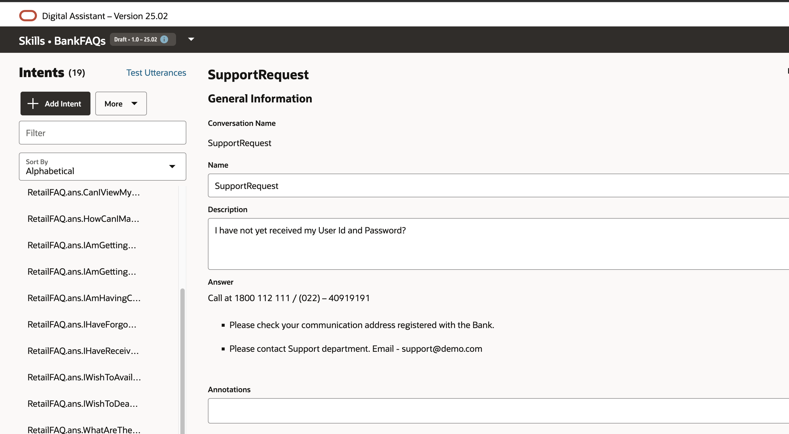

## Task 15: Demo of chatbot in Oracle APEX Page

1. Click on chat icon to launch chat. Bot will initiate conversation with message

    *Hello, How can i help you today.*  

2. From the auto complete questions user selects

    *How to open bank account* 

    Bot replies back with answer

    *Opening a bank account is a straight forward process that can be completed in a few steps:*

	* *Login to your Bank Account. If you do not have login details, please Create an Account ....*

    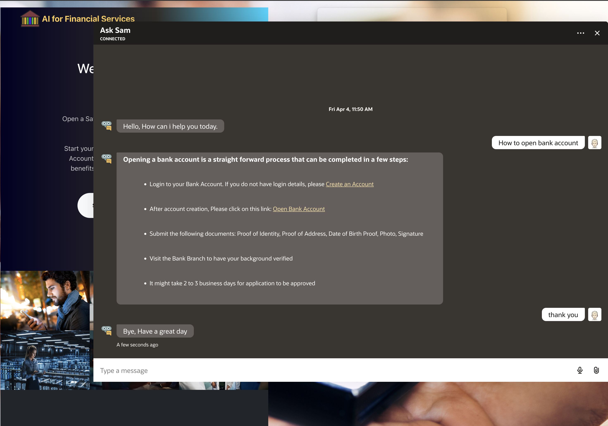

3. User says *Bye* and Bot understands the **exit intent**

    replies back with a greeting

    *Bye, Have a great day*
   
  > **Congratulations**, you have completed **Setup Oracle Digital Assistant** Lab. The subsequent labs are optional, however, please proceed to the next lab to learn more about **APEX Integration with Oracle Digital Assistant**. -->

## Acknowledgements

* **Author** - Madhusudhan Rao B M, Principal Product Manager, Oracle Database
* **Last Updated By/Date** - April 4th, 2025

## Learn more
 
* [Oracle Digital Assistant Skills](https://docs.oracle.com/en/cloud/paas/digital-assistant/use-chatbot/create-configure-and-version-skills1.html)
