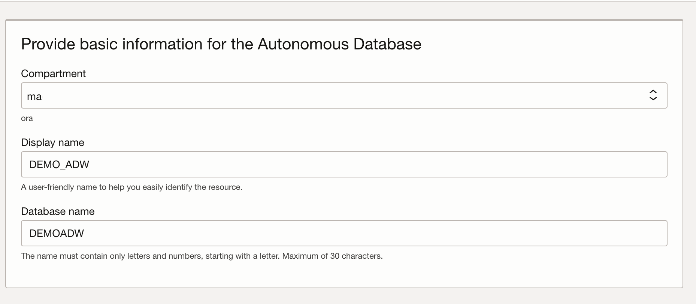
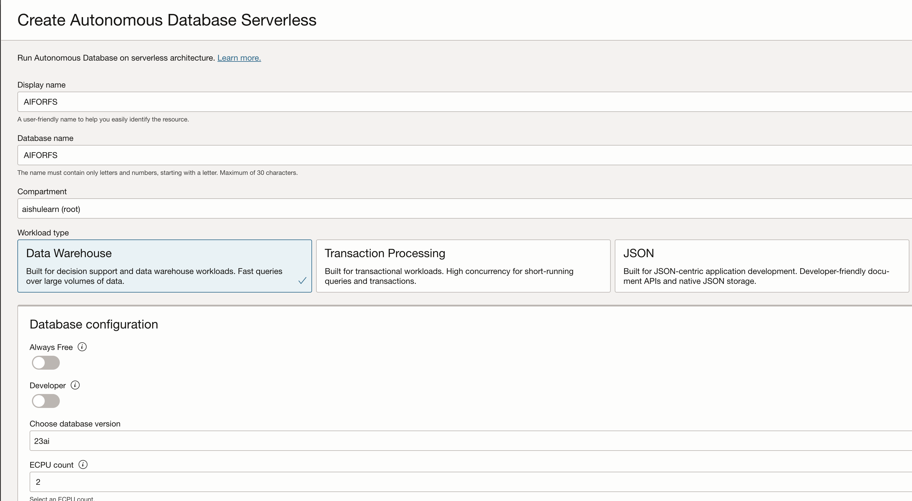
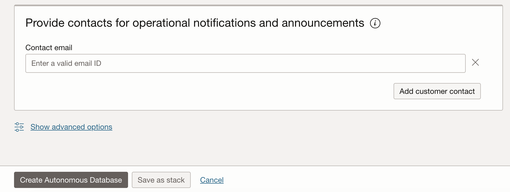
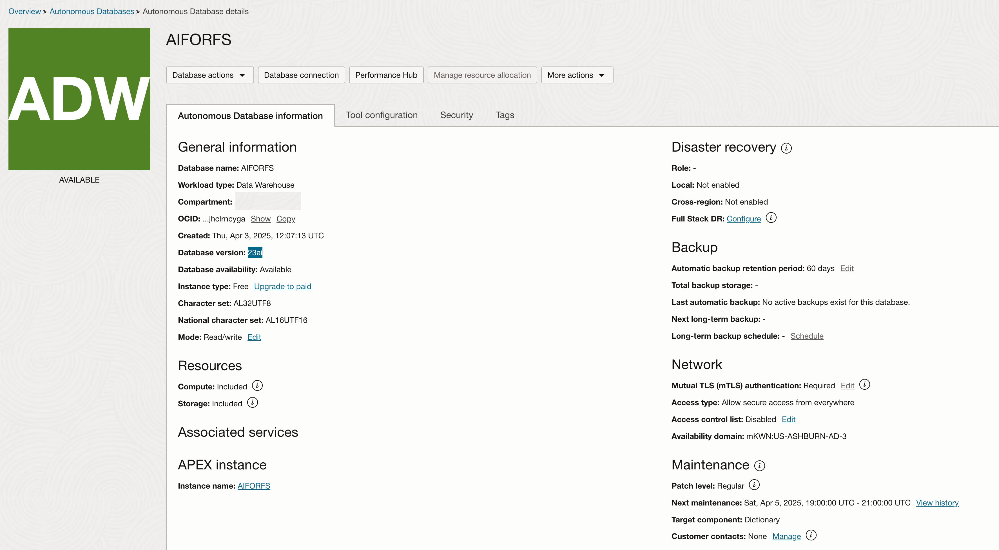
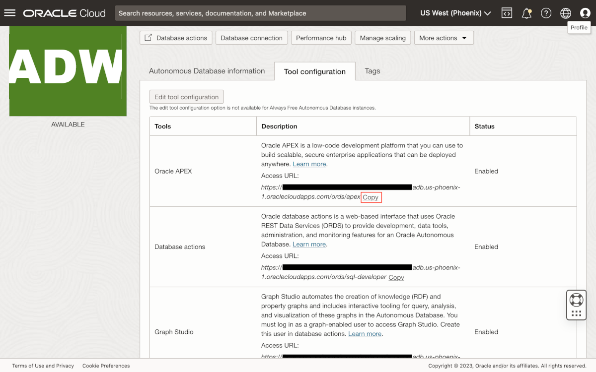
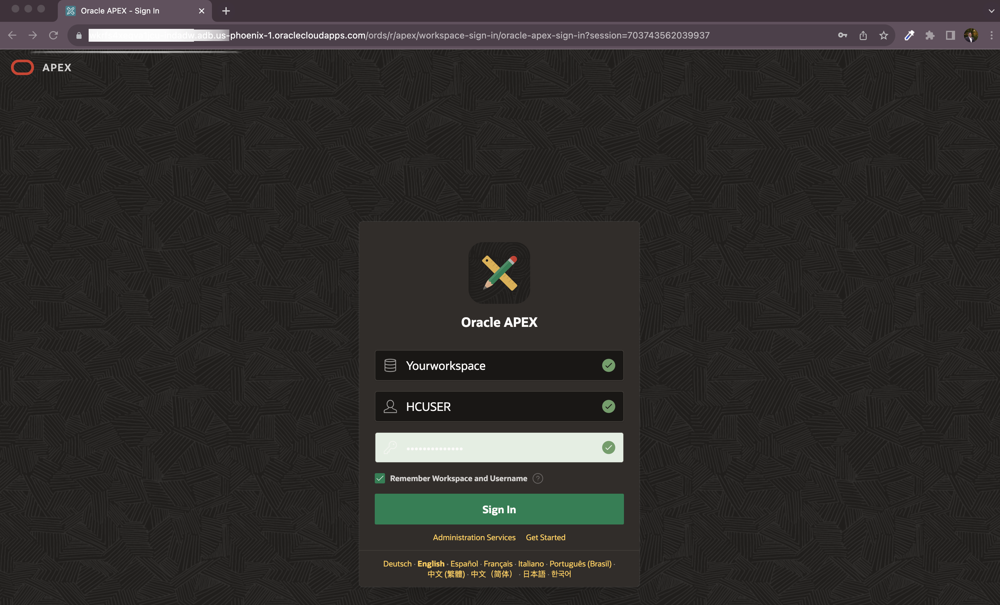
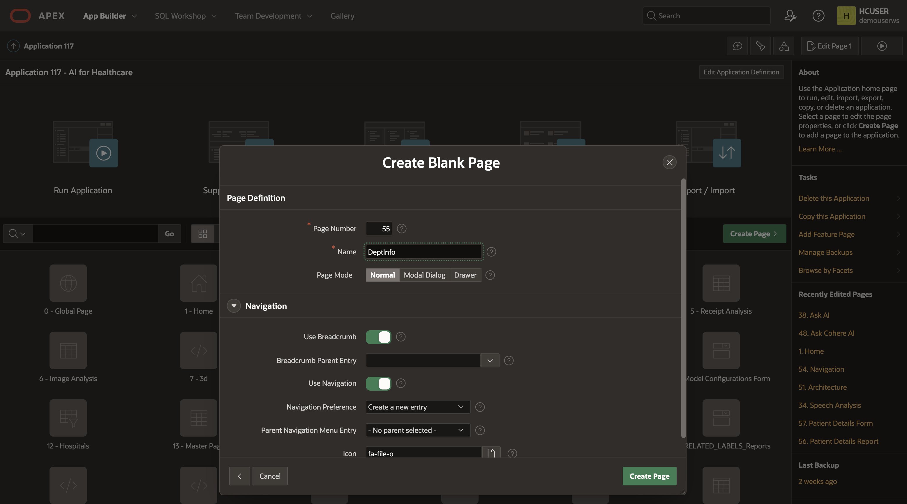
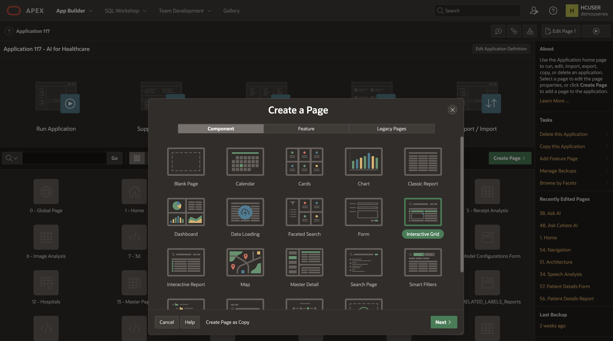
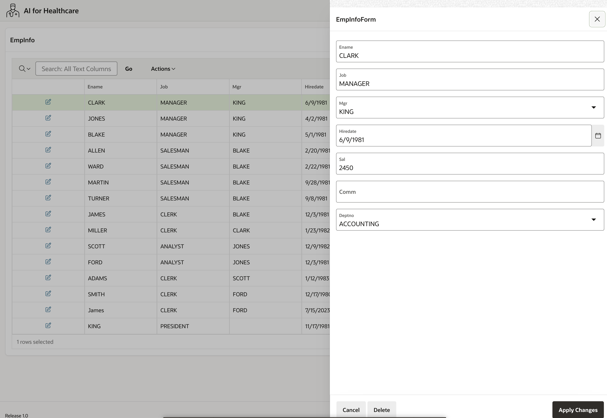
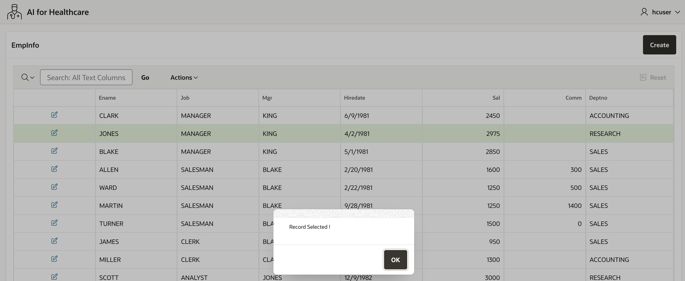

# Unlock the Power of Oracle Autonomous Database and Oracle APEX: A Step-by-Step Guide

## Introduction

This article provides a comprehensive walkthrough of creating an Oracle Autonomous Database 23ai instance creation and leveraging Oracle APEX to build low-code, data-driven applications. 

Through a series of hands-on tasks, readers will learn how to:

- Create and configure an Oracle Autonomous Database instance
- Access Database Actions and run SQL queries
- Set up an Oracle APEX Workspace and run SQL queries
- Configure Oracle APEX Web Credentials and login to the platform
- Build a blank Oracle APEX page and create low-code, data-driven pages with CRUD operations
- Develop dynamic actions and create interactive APEX charts
  
By following these steps, readers will gain the skills and knowledge needed to harness the power of Oracle Autonomous Database and APEX, enabling them to build efficient, scalable, and secure applications with ease.

Estimated Time: 30 minutes

### Objectives

In this lab, you will:

- Learn how to provision a new Oracle Autonomous Database
- Learn some of the important Oracle APEX How to's (This is Optional)

### Prerequisites

- This lab requires completion of the Get Started section in the Contents menu on the left.

## Task 1: Create or select a compartment
 
A compartment is a collection of cloud assets, like compute instances, load balancers, databases, and so on. By default, a root compartment was created for you when you created your tenancy (for example, when you registered for the trial account). It is possible to create everything in the root compartment, but Oracle recommends that you create sub-compartments to help manage your resources more efficiently.

If you are using an Oracle LiveLabs-provided sandbox, you don't have privileges to create a compartment and should skip this first task. Oracle LiveLabs has already created a compartment for you and you should use that one. Even though you can't create a compartment, you can review the steps below to see how it is done.

> **Note:**  If you already have a compartment created, you can **optionally skip this Task**.


1. Click the three-line menu on the top left of the console. Scroll down to the bottom of the menu, click **Identity & Security -> Compartments**.

    

    Then, click the **Create Compartment** button to create a sub-compartment.

    

2. Give the compartment a name and description. Be sure your root compartment appears as the parent compartment. Press the blue **Create Compartment** button.

    

    The compartment is created and you can use it for your cloud services!

## Task 2: Choose Autonomous Database from the services menu

1. Log in to the Oracle Cloud.
2. Once you log in, the cloud services dashboard shows all the services available to you. Click the **navigation menu** in the upper left to show top-level navigation choices.

3. This lab shows the provisioning of an Autonomous Data Warehouse database. Click on **Oracle Database**, then select **Autonomous Data Warehouse**.

    


4. Make sure your Workload Type is __Data Warehouse__ or __All__ to see your Autonomous Data Warehouse instances. Use the __List Scope__ drop-down menu to select a compartment. <if type="livelabs">Enter the first part of your user name, for example `LL185` in the Search Compartments field to quickly locate your compartment.
 
    <if type="freetier">
    

    > **Note:** Avoid using the `ManagedCompartmentforPaaS` compartment, as this is an Oracle default used for Oracle Platform Services.
   </if>

5. This console shows that no databases yet exist. If there were a long list of databases, you could filter the list by the **State** of the databases (Available, Stopped, Terminated). You can also sort by __Workload Type__. In this example, __Data Warehouse__ is the workload type.

    

<if type="freetier">
1. You can see your current default **region** in the top right-hand corner of the page.
    
</if>

## Task 3: Create the Oracle Autonomous Database instance
   
1. Click **Create Autonomous Database** to start the instance creation process.

    

2.  This brings up the __Create Autonomous Database__ screen, where you will specify the instance's configuration.

3. Specify basic information for the Autonomous Database:

    - __Compartment__ - Leave the default compartment.
    - __Display Name__ - Enter a memorable name for the database for display purposes. For example, use __DEMO\_ADW__.
    - __Database Name__ - Use letters and numbers only, starting with a letter. The maximum length is 30 characters.  
    <if type="freetier">
         
    </if>
    - __Workload Type__ - For this lab, choose __Data Warehouse__ as the workload type.
    - __Deployment Type__ - For this lab, choose __Serverless__ as the deployment type.
      
    - __Always Free__ - For this lab, we will leave Always Free **unchecked**.
    - __Choose database version__ - Select a database version **23ai** from the available versions.
    - **Choose network access**: For this lab, accept the default, **Secure access from everywhere**.
    

    <if type="freetier">
    Choose a license type. For this lab, choose __License Included__. The two license types are:
    </if> 

    - __Bring Your Own License (BYOL)__ - Select this type when your organization has existing database licenses. [learn more](https://www.oracle.com/cloud/pricing/)
    - __License Included__ - Select this type when you want to subscribe to new database software licenses and the database cloud service.
    - __Oracle Database Edition__ - Select __Oracle Database Enterprise Edition__. This option is available only if you have selected __Bring Your Own License (BYOL)__

4. Configure the database:
 
    - __ECPU count__ - Number of ECPU for your service. For this lab, specify __2 ECPU__.  
    - __Storage (TB)__ - Select your storage capacity in terabytes. For this lab, specify __1 TB__ of storage.  
    - __Auto Scaling__ - Auto Scaling - For this lab, keep auto-scaling **unchecked**. If autoscaling is enabled, the system will automatically use up to three times more CPU and IO resources to meet workload demand. learn more about [auto scaling](https://docs.oracle.com/en/cloud/paas/autonomous-database/adbsa/autonomous-auto-scale.html)
   
        Backup retention period, default to 60 days.

        Create administrator credentials:

        

    - __Password and Confirm Password__ - Specify the password for the **ADMIN** user of the service instance.  
    - Autonomous Database requires strong passwords.
  
1. The **Contact Email** field allows you to list contacts to receive operational notices and announcements as well as unplanned maintenance notifications. This is optional.

    
 
    Click on __Create Autonomous Database__. button
 
2.   Your instance will begin provisioning. In a few minutes, the State will turn from Provisioning to Available. At this point, your Autonomous Data Warehouse database is ready to use! Have a look at your instance's details here, including its name, database version, OCPU count, and storage size.
   
   

    If you had issues in creating Oracle Autonomous Database 23ai please check this video.

   [Demo video on AI for Financial Services](youtube:-d-DxUJ3DvI:large) 
 
## Task 4: Access Database Actions run SQL queries 

1. From Database Actions menu we can run common tasks such as running SQL queries, Data Modeler, REST API development etc.  

    Click the **Database Actions** button.

    

    

    Select the **SQL** tab to open the **SQL worksheet**.

    
     
## Task 5: How to create an Oracle APEX Workspace

1. Once the Autonomous Database has been fully provisioned, return to the *Autonomous Database* page, locate the instance's display name, and then click on it to view the ADB's details page. Click the *Tools* tab. 
2. Click the *Copy* button to copy the URL to launch the Oracle APEX development environment. Open the link in a new browser window or tab.

3. For new Autonomous Database instances, this should launch the **Administration Services** login screen. Enter the password for the *admin* user and click the **Sign In to Administration** button.

4. Again, for new Autonomous Database instances, after a successful login, the browser will redirect to the page shown below. Click the **Create Workspace** button.

5. Click and select the **New Schema** option.

1. Enter the desired **Workspace Name** and **Workspace Username**. The will be used to create an Oracle Database user account. Also, provide a new **Workspace Password** that conforms to the same password policy. Click the **Create Workspace** button to create the workspace.

1. After the workspace has been successfully provisioned, click the button on the top-right, and then click the **Sign out** button to return to the App Builder login screen.

1. Enter the workspace name, username, and password set earlier when creating the workspace. Click the **Sign In** button to access the newly created workspace.

1. After successful authentication, the browser will redirect to the default App Builder landing page where workspace administrators and developers will have access to various functionalities to develop and manage APEX applications.


## Task 6: How to run SQL queries in Oracle APEX

There are several ways to run SQL queries, few most frequently used techniques are listed below.

1. You can run SQL queries in APEX Workspace under **SQL Workshop** in top navigation and select Option **SQL Commands**
2. Copy paste SQL queries in the editor window and click on **Run** button

    

3. Some times you might need to run SQL queries within an APEX page for example displaying data from a table, such SQL queries can be written in SQL Query Editor, this query executes during the page runtime. 

    

4. Some times you might need to run SQL queries based on a button click, in that case create **Dynamic Action** under the button, and add **Execute server side code**

    

## Task 7: How to setup Oracle APEX Web Credentials

Oracle APEX Web Credentials provides a convenient and secure mechanism for storing the following types of credentials:

* Basic Authentication (Username & password)
* OAuth2 Client Credentials (Client ID & Client Secret)
* OCI Native Authentication (Access Oracle Cloud Resources, e.g., Object Storage)
* HTTP Header (The credential is added to the REST request as an HTTP Header)
* URL Query String (The credential is added to the URL of the REST request as a Query String Parameter).

We will be using OCI Native Authentication required to connect with Object Storage

1. In the APEX top navigation Select **App Builder**, Click on **Workspace Utilities**   

    

    Select **Web Credentials**

    

    Click on **Create**

    

    Provide **User OCID**, **Tenancy OCID**, **Fingerprint**, **Private Key** and authentication type as **Oracle Cloud Infrastructure**

    

    > **Note:** If you are new to OCI, Information on how to get these OCIDs is provided in next Lab **Setup OCI CLI**.

## Task 8: How to login to Oracle APEX

We will see how to login to Oracle APEX environment

1. Typically Oracle APEX Urls will be like this 
   
    ```text
    <copy>
    https://randomid-dbname.dbtype.regionid.oraclecloudapps.com/ords/f?p=appnumber:pagenumber:sessionid 
    </copy>
    ``` 

    For example 

    ```text
    <copy>
    https://doesnotmatter.adb.us-phoenix-1.oraclecloudapps.com/ords/f?p=4550:1:714943545900442
    </copy>
    ``` 

3. Login with the Workspace name, Username and Password as provided by the Workspace Administrator

    

## Task 9: How to create Blank Oracle APEX page

1. First you need to create Blank Application or Application that uses sample Apps, from there you can create APEX pages
2. Click on the Application that has been created.
3. Click **Create Page** button blank APEX page

    

    Select **Blank Page** and Click **Next**

    

    Provide page name and **Create Page**

    

## Task 10: How to Create Low-Code Data Driven APEX page with CRUD Operations

Similarly, if you want to create a no-code data driven page that allows you to perform CRUD operations on a table, 

1. Select **Interactive Grid** Template

    

    Provide page name, Include page form

    

    Page mode can be Drawer or Normal. Select the database table on which you would like to do CRUD Operations (Create, Read, Update and Delete records)

    

    This automatically picks up the primary key of that table.

    

    Two Pages are Automatically Generated, first one will display data and second one will be a record edit page. 

    

    Click on the Run button at top right with an arrow symbol. This will display page in run mode. 

    

    Click on the Edit Icon on extreme left of a record, this will open a popup

    

## Task 11: How to Create Dynamic Actions 

Sometimes, you may want to create Dynamic Actions on a table data or on a button click, such as executing a server side code that invokes a PL/SQL procedure or runs a Javascript code or just submits a page.

1. Select **Dynamic Actions**, Create a new Dynamic Action
2. Select an Event type for example Click, Double Click, Selection Change etc..
  
    

3. Create **True** Action, In this example we will select **Alert** if a record is selected.

    

## Task 12: How to Create APEX Chart

Sometimes, you may want to display data in a chart for example Bar Chart or Pie Chart or Stacked Bar chart etc. for this the SQL Query should contain a Label and a Numeric Value 

1. Create a new **Region**
2. Drag and Drop **Chart** into that newly created region.
  
    

3. Write a SQL Query and select Label and Value

    ```sql
    <copy>
        Select ENAME, SAL from EMP;
    </copy>
    ``` 

    

4. Run the page (Pages are Automatically saved when you run them)

    
    
  
You may now **proceed to the next lab**.

## Learn more

- See the [Autonomous Database GetStarted Guide](https://docs.oracle.com/en/cloud/paas/autonomous-database/adbsa/getting-started.html)  for using Autonomous Data Warehouse.
- Go to the [Data Warehousing Insider blog](https://blogs.oracle.com/datawarehousing/) for more information on network connectivity options mentioned in this workshop.

## Acknowledgements

- **Author** - [Madhusudhan Rao B M](https://www.linkedin.com/in/madhusudhanraobm/), Principal Product Manager, Oracle Database
* **Last Updated By/Date** - Apr 3rd 2025
* **Updates** - Database Actions & Oracle Database 23ai version upgraded