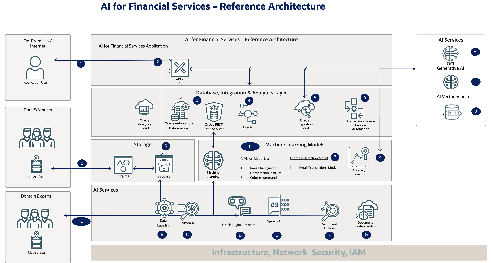
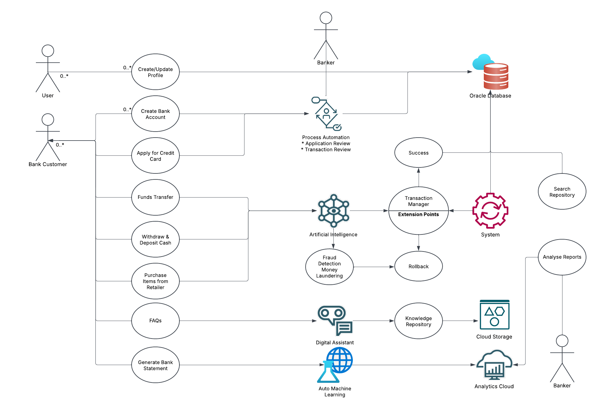

# Introduction

## About this workshop
 
In today's digital age, the banking and financial services sector has undergone a significant transformation. The rise of online banking, mobile banking apps, and digital payment systems has revolutionized the way customers interact with financial institutions. This workshop provides a comprehensive guide to the digital banking ecosystem, covering various aspects of online banking, from initiating conversations with chatbots to ensuring business continuity through high availability and disaster recovery.

Through 23 labs, this workshop takes readers on a journey through the digital banking landscape, exploring topics such as user profile management, account creation, fund transfers, e-commerce transactions, credit card applications, fraud detection, and spend analytics. The book also delves into the importance of ensuring business continuity, highlighting the need for high availability and disaster recovery measures.

Whether you are a banking professional, a fintech enthusiast, or simply someone interested in understanding the digital banking ecosystem, this book provides valuable insights and knowledge to help you navigate the complex world of digital banking.
 
Estimated Workshop Time: 20 hours

*Estimated Workshop Time can vary depending upon the Labs that you choose to do, and all labs from lab 5 are Optional.*

---

### Prerequisites 
 
This lab assumes you have the following:

* An Oracle account
* Intermediate developer knowledge of Oracle APEX and Oracle PL/SQL 

---

### Objectives 

**Hands-on Learning Experience: Mastering Cutting-Edge Technologies**

In this comprehensive learning journey, you will gain hands-on experience with the following technologies:

**Oracle APEX and Database Technologies**

* Oracle APEX Custom Authentication and Authorization
* Role-based access and ORDS
* Oracle APEX Workflow/Process and Task Definition
* Transaction Management, Enqueue, and Dequeue
* Security and Oracle Database 23ai & PL/SQL
* Real-time Dashboard Oracle APEX

**AI and Machine Learning Services**

* AI Services: Meta Llama Vision Instruct, Speech AI (TTS), and Anomaly Detection AI Service
* Auto Machine Learning and Oracle Database 23ai
* Select AI & AI Vector Search
* RAG with Gen AI (Cohere)

**Data Management and Analytics**

* Converged Database (JSON, Graphs, Maps & Spatial Data)
* JSON Relational Duality and Data Redaction (Security)
* Oracle Analytics Cloud and Notifications & Analytics

**Integration and Process Management**

* Oracle Integration Cloud (Gen 3)
* Oracle Process Management and PL/SQL Scheduler Jobs
* Property Graphs and Oracle Digital Assistant (FAQs)

**Fraud Detection and Prevention**

* Fraud Detection, Card Blocking, and Push Notifications

By mastering these technologies, you will gain a competitive edge in the industry and be equipped to develop innovative solutions that drive business success.

---
 
### AI for Financial Services - Demo

[Demo video on AI for Financial Services](youtube:xCXb7kOWdqo:large)  

---

### AI for Financial Services - Technology Architecture

  

---

### AI for Financial Services - Use Cases
  

---

| Roles: Common Users (Public) | Bank Customers | Bankers (Bank Officials) | 
| -------- |:-------| :-----|
| Create Profile | Update Profile | - |
| Apply for Bank Account | - | Business Process - Review Application |
|   | Deposit cheque in ATM |   |
|   | Withdrawal of cash in ATM |   |
|   | Apply for credit card |   |
|   | Internal Bank fund transfer | Worklist - Review Fund Transfer  |
|   | External Bank fund transfer |   |
|   | Retail online purchase |  Fraud Detection |
|   | Generate Bank statement |  Money Laundering |
|   | Home Loan EMI Calculator | Money Mules  |
|   |   | Customer Analysis  |
|   |   | Spend Analysis |
|   |   | Manage Customers  |
|  AI Search - (LLM) |  AI Search - (LLM) | AI Search - (DB+LLM+KM)+  |

***Where + indicates***

* LLM - Large Language Models
* DB - Database Search with Select AI
* KM - Knowledge Management Search (AI Vector Search)

---

### AI for Financial Services - Table of Contents
 
**Common Labs**

* Introduction
* Get Started
* Lab 1: Setup OCI Policies
* Lab 2: Create an Oracle Autonomous Database

**AI for Financial Services Labs** - Lab 3 to Lab 20 

* Lab 3: Initiating a Conversation with a Chatbot
* Lab 4: User Profile Management: Creation and Updates
* Lab 5: Account Creation: Establishing a New Bank Account
* Lab 6: External Fund Transfer: Transferring Money to an Internal Bank Account
* Lab 7: Internal Fund Transfer: Transferring Funds Between Accounts
* Lab 8: Cash Withdrawal: Withdrawing Cash from an ATM
* Lab 9: Cheque Deposit: Depositing Cheques at an ATM
* Lab 10: E-commerce Transactions: Purchasing Items Online with Debit/Credit Cards
* Lab 11: Statement Generation: Accessing Bank Statements
* Lab 12: Credit Card Applications: Applying for a New Credit Card
* Lab 13: Credit Card Approval and Review Processes
* Lab 14: Fraud Detection and Alerts: Identifying Suspicious Credit Card Activity
* Lab 15: Anti-Money Laundering and Money Mule Detection
* Lab 16: Suspicious Transaction Alerts and Monitoring
* Lab 17: Spend Analytics: Categorizing and Analyzing Expenditure
* Lab 18: Transaction Search and Knowledge Repository
* Lab 19: Frequently Asked Questions (FAQs)
* Lab 20: Home Loan Planning: Calculating Equated Monthly Installments (EMIs)

**Infrastructure Related Labs**
 
* Lab 21: Ensuring Business Continuity: High Availability and Disaster Recovery
  
## Acknowledgements

* **Architect, Author and Developer** - [Madhusudhan Rao B M](https://www.linkedin.com/in/madhusudhanraobm/), Principal Product Manager, Oracle Database
* **Thanks to** - [Bo English-Wiczling](https://www.linkedin.com/in/boenglish/), Senior Direct, Program Management, Oracle Database 
* **Last Updated By/Date** - April 3rd, 2025
* **Document version** - 1.0 